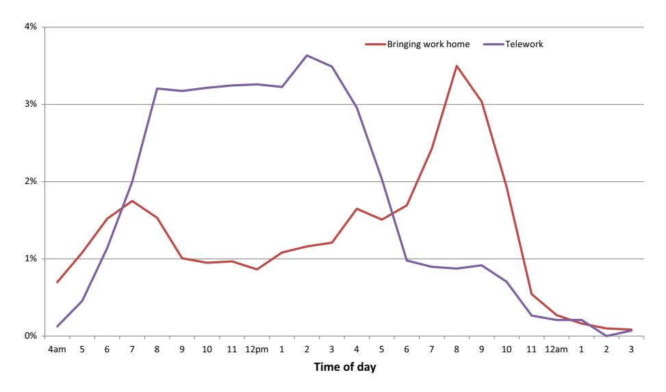

#### **RESEARCH PAPER**

# **Does Telework Stress Employees Out? A Study on Working at Home and Subjective Well‑Being for Wage/Salary Workers**

**Younghwan Song1 · Jia Gao[2](http://orcid.org/0000-0001-6588-8176)**

Published online: 4 November 2019 © Springer Nature B.V. 2019

#### **Abstract**

With the expansion of high-speed internet during the recent decades, a growing number of people are working from home. Yet there is no consensus on how working from home afects workers' well-being in the literature. Using data from the 2010, 2012, and 2013 American Time Use Survey Well-Being Modules, this paper examines how subjective well-being varies among wage/salary workers between working at home and working in the workplace using individual fxed-efects models. We fnd that compared to working in the workplace, bringing work home on weekdays is associated with less happiness, and telework on weekdays or weekends/holidays is associated with more stress. The efect of working at home on subjective well-being also varies by parental status and gender. Parents, especially fathers, report a lower level of subjective well-being when working at home on weekdays but a higher level of subjective well-being when working at home on weekends/holidays. Non-parents' subjective well-being does not vary much by where they work on weekdays, but on weekends/holidays childless males feel less painful whereas childless females feel more stressed when teleworking instead of working in the workplace. This paper provides new evidence on the impact of working at home and sheds lights for policy makers and employers to re-evaluate the benefts of telework.

**Keywords** Working at home · Telework · Subjective well-being · Happiness · Time use

**JEL Classifcation** J22 · J28 · D1

2 Poverty and Equity Global Practice, the World Bank, Washington, D.C., USA

\* Jia Gao jgao4@worldbank.org

1 Department of Economics, Union College, Schenectady, NY 12308, USA

### **1 Introduction**

With the expansion of residential high-speed internet and advances in telecommunication tools, recent decades have seen an increased prevalence of people working from home. In 2003, about 15% of wage/salary workers reported that they worked from home at certain times on an average day, whereas in 2016, this number went up to 19%.[1,](#page-1-0)[2](#page-1-1) Currently, half of the US workforce has a job that allows them to work from home at least part time, and the number of employees who regularly work from home more than doubled from 2005 to 2015.[3](#page-1-2) In addition to the development of technology, the reduced wage penalty for teleworkers, increased work–family conficts, and rising female labor force participation also led to this homeworking trend (Felstead et al. [2005](#page-17-0); Oettinger [2011](#page-18-0)).

In both media and academic literature, two contradictory images of homeworking exist. Some people depict it as "the best of both worlds" because it facilitates the integration of paid work and family, whereas others portray it as "cutting my own throat" because of the negative intrusions on work in home (such as a cat sitting on the laptop, a baby crying on the ground, or a dog chewing on the shoes) and excessive workload (Mirchandani [2000](#page-18-1)). To further investigate whether homeworking is associated with positive afect, this paper evaluates the impact of working at home on wage/salary workers' instantaneous subjective well-being (SWB) measured by happiness, pain, sadness, stress, tiredness, and meaningfulness. Here, working at/from home (or homeworking) means conducting job-related work at home rather than doing housework or childcare. Although working at home usually refers to telework, defned as conducting formal, paid work at home during normal business hours, a majority of homeworkers are not typical teleworkers and do not have a formal agreement with their employers (Fenner and Renn [2010;](#page-17-1) Nätti et al. [2011](#page-18-2); Ojala [2011;](#page-18-3) Song [2009;](#page-18-4) Sullivan [2003;](#page-18-5) Wight and Raley [2009](#page-19-0)). They perform unfnished work or catch up on work at home, mostly during evenings and weekends. Since these two patterns of homeworking may afect SWB diferently, we diferentiate telework from bringing work home in our analysis.

In practice, working at home can afect one's SWB diferently from working in the workplace in several ways. First, regardless of which type of working at home one engages in, work–life balance is the main mechanism through which homeworking can afect SWB, although existing evidence is inconclusive. A few studies have shown that remote work enhances quality of life by allowing employees to take work–family dual roles simultaneously (for example, Azarbouyeh and Naini [2014](#page-17-2); Wight and Raley [2009\)](#page-19-0). Contradicting evidence, however, indicates that blending personal and professional life increases negotiation in families (Baines and Gelder [2003\)](#page-17-3) and leads to a higher level of stress (Sullivan [2012](#page-18-6); Weinert et al. [2015](#page-18-7)). Second, telework may increase SWB by giving employees more fexibility and autonomy, which could allow them to better manage and organize their time and work more productively (Kemerling [2002](#page-17-4)). Third, telework

3 The statistics are from GlobalWorkplaceAnalytics.com based on an analysis of the 2005–2015 American Community Surveys. Website:<http://globalworkplaceanalytics.com/telecommuting-statistics>.

1 We calculate the statistics using the 2003 and 2016 American Time Use Surveys. The sample is restricted to non-self-employed wage/salary workers.

2 Using the 2003–2007 American Time Use Surveys, Allard and Lacey ([2009\)](#page-17-5) show that about 12% of fulltime workers with a single job did some work at home on an average day during their study period. They restrict the sample to full-time workers with a single job and include self-employed workers, whereas we limit the sample to full-time non-self-employed workers. Therefore, their estimates are not directly comparable to ours.

may improve SWB by reducing commute time, which is a pivotal factor in determining workers' instant enjoyment and is related to tiredness, stress, and women's psychological health (Gottholmseder et al. [2009;](#page-17-6) Roberts et al. [2011;](#page-18-8) Wener et al. [2003\)](#page-18-9). Fourth, diferent from those who engage in teleworking, people who bring work home tend to work longer hours, making it more difcult for them to rest and recover and resulting in more tiredness. Working overtime at the expense of family may jeopardize employees' SWB by raising work–family confict, increasing the workers' guilt about neglecting their families and resulting in more family disputes (Ojala [2011\)](#page-18-3). Finally, doing unpaid overtime work at home may be considered more meaningful if it is a form of investment voluntarily made by workers who expect higher wages or a promotion in the long run, especially for well-educated managers and supervisors (Song [2009](#page-18-4)). As we can see, without empirical tests, it is difcult to tell whether homeworking afects employee well-being positively or negatively.

SWB is an important component when measuring quality of life. The purpose of this paper is to examine whether working at home improves SWB for wage/salary workers. To this end, we compare the afective utility derived from working at home to that gained in the workplace by using data from the 2010, 2012, and 2013 American Time Use Survey Well-Being Modules. Instead of utilizing global reports of happiness or satisfaction with life, we use instant feelings experienced in working and other activities on a diary day to measure the SWB. The fxed-efects model is adopted in the empirical estimation because it can control for individual heterogeneity. We fnd that the overall impact of working at home on SWB is negative. After decomposing working at home into bringing work home and telework, we show that compared to working in the workplace, bringing work home on weekdays leads to a reduction in happiness, and telework on weekdays or weekends/holidays results in an increase in stress. The efect of working at home also varies by parental status and by gender. Parents' SWB is more likely to be afected by where they work than that of non-parents. On weekdays working at home instead of in the workplaces deteriorates parents' SWB, whereas on weekends/holidays it improves parents' SWB. For non-parents, telework on weekends/holidays reduces pain for males but increases stress for females.

This paper contributes to the literature in the following ways. Existing economic studies on remote work have mainly focused on its impact on wages and hours worked (for example, Edwards and Field-Hendrey [2001,](#page-17-7) [2002;](#page-17-8) Oettinger [2011\)](#page-18-0), and no published papers have investigated the association between working from home and SWB among wage/salary workers. Although research from the felds of management, psychology, and sociology has looked at outcomes such as work–life balance and job satisfaction, few studies conducted serious quantitative analysis. In addition, the efect of informal, unpaid, overtime work at home has not been fully understood and has been ignored in the discussion on fexible working. By exploring how wage/salary earners' SWB difers between working at home and working in the workplace, by the type of homeworking, by weekdays/weekends, by gender, and by parental status, this paper provides new evidence on homeworking and subjective well-being. To the best of our knowledge, this is the frst study that empirically tests the efect of working at home on episode-level SWB for wage/salary workers. Our paper sheds light on two opposing claims about working at home and provides a nuanced understanding of the negative impact of working from home.

The remainder of the paper is organized as follows. In Sect. [2](#page-3-0), we review the literature on fexible working. Section [3](#page-4-0) describes the data and the empirical method. Section [4](#page-9-0) presents the results, and Sect. [5](#page-12-0) discusses the fndings. Finally, Sect. [6](#page-15-0) provides concluding remarks.

### **2 Literature Review**

Although a relatively popular belief about telework is that it improves employees' quality of life and enhances work–life balance, no consensus exists in the literature on whether it benefts employees overall. On the one hand, a majority of studies have found that telecommuting is benefcial for both frms and employees, and even for the urban economy (for example, Apgar [1998](#page-17-9); Gajendran and Harrison [2007](#page-17-10); Nätti et al. [2011\)](#page-18-2). It is associated with increased perception of autonomy (Dambrin [2004](#page-17-11); Wilson and Greenhill [2004](#page-19-1)), higher productivity (Kemerling [2002\)](#page-17-4), greater work–life balance and less stress (Azarbouyeh and Naini [2014](#page-17-2); Felstead et al. [2002](#page-17-12); Raghuram and Wiesenfeld [2004](#page-18-10); Sullivan and Lewis [2006](#page-18-11)), greater employee satisfaction (Wheatley [2012](#page-19-2)), and better job performance (Fonner and Rolof [2010](#page-17-13)). Moreover, the positive efect of telework on work–life balance is larger for those who work at home more extensively, stay for longer periods, and have more family responsibilities (Golden [2006;](#page-17-14) Shockley and Allen [2007\)](#page-18-12).

On the other hand, conficting views and contradicting evidence exist in the extant literature as well. One concern regarding telework is that lack of interactions with coworkers may result in social isolation and worsen individual and group performance (Sparrowe et al. [2001](#page-18-13)). Being "out of sight, out of mind," telecommuters have less face time with managers, which can endanger their evaluations, limit their opportunities for promotion, and increase their role stress (Weinert et al. [2015\)](#page-18-7). Bailey and Kurland [\(2002](#page-17-15)) review 80 empirical studies on telework and conclude that little clear evidence is available to show that telework is related to increased job satisfaction and productivity as it is asserted to do. A recent study also fnds that telework has no efect on supervisor-rated productivity by conducting a quasi-feld experiment (van der Meulen et al. [2014\)](#page-18-14). Another concern regarding telework is that it can intensify work–family conficts and increase stress because it blurs the boundaries between home and workplaces (Hardill and Green [2003;](#page-17-16) Mann and Holdsworth [2003;](#page-18-15) Russell et al. [2009;](#page-18-16) Standen et al. [1999;](#page-18-17) Sullivan [2012](#page-18-6); Wheatley et al. [2008](#page-19-3)). Mirchandani ([2000\)](#page-18-1) argues that homeworking is a cause of anxiety and stress because homeworkers have to integrate their work and family activities. Moore [\(2006](#page-18-18)) shows that working from home does not improve quality of life concerning subjective or objective well-being and reports that homeworkers with young children doing menial, low-paid work are more stressed. Previous research also suggests that the efect of fexible working difers by gender: the work–family confict and stress are more pronounced for women and single parents because they are more likely to work at home for childcare reasons (Hoque and Kirkpatrick [2003](#page-17-17); Standen et al. [1999\)](#page-18-17). The efect of telework may also depend on the extent of telework and job attributes. For example, Golden and Veiga ([2005\)](#page-17-18) provide evidence of an inverted U-shaped relationship between extensive levels of telecommuting and job satisfaction.

Working at home includes not only telecommuting during normal business hours, but also bringing work home to fnish after business hours. Using the Work Schedules and Work at Home Supplement to the May 2001 Current Population Survey, Song [\(2009](#page-18-4)) shows that most homeworkers bring work home from the job without a formal arrangement. People choose to conduct informal, unpaid overtime work at home for diferent reasons, such as catching up on work, looking for opportunities for promotion, or having less bargaining power at work (for a summary of reasons, see Song [2009](#page-18-4)). This type of homeworking generally results in working long hours in the evenings and on weekends, and its efect on employee well-being is relatively less explored in the literature. Although it may raise future earnings (Bell and Freeman [2001;](#page-17-19) Schroeder and Warren [2004;](#page-18-19) Pannenberg

[2005\)](#page-18-20), it can also increase work–family confict and negative reactions from spouses (Ojala et al. [2014\)](#page-18-21).

In the growing literature on home-based work, outcomes such as wages or work–family conficts have been largely studied, but instantaneous SWB has not been explored yet. Only two papers are closely related to our research. One is Ojala et al. ([2014\)](#page-18-21), which studies how informal overtime work at home difers from formal telework regarding work–family interface using the 2003 and 2008 Finnish Quality of Work Life Surveys. They fnd weak evidence for the notion that working at home is associated with positive work–family balance but a strong connection between overtime work at home and increased confict over the allocation of time, increased guilty feelings about neglecting issues at home, and increased negative reactions from spouses. Unlike their study measuring work–family interactions using stylized questions, our research uses U.S. time-use data and examines various dimensions of SWB based on episode-level afect questions that measure moment-to-moment SWB. Furthermore, given the fact that respondents report up to three episodes of activities on a diary day, our paper controls for worker-level heterogeneity by employing individual fxed-efects models.

The other related paper is Gimenez-Nadal et al. [\(2018](#page-17-20)), which mainly analyzes the characteristics of teleworkers but also investigates how telework afects SWB. Although they use the same data source (the 2012 and 2013 American Time Use Survey Well-Being Modules), their empirical research method is diferent from ours. They restrict the sample to market work activities by excluding nonworking activities, which leads to a small sample size, and they adopt simple OLS models that cannot address individual heterogeneity. Moreover, because they only control for limited demographic and job characteristics, their models are more likely to be subject to omitted variable bias. In contrast, our paper considers two types of homeworking, separates the sample by weekdays and weekends, includes a comprehensive set of confounding factors, has one additional year of well-being data and a larger sample, and employs fxed-efects models. Overall, we adopt a more complicated research design and a more accurate research method, leading to more reliable results.

### **3 Data and Methodology**

#### **3.1 Data**

This study uses data drawn from the 2010, 2012, and 2013 American Time Use Survey Well-Being Modules. The American Time Use Survey is a time-diary study that has been conducted continuously since 2003 by the U.S. Census Bureau, based on a nationally representative sample of the US population aged 15 or over. Through telephone interviewing, this survey collects a detailed account of respondents' activities during a 24-h period on a preassigned day of the week. This diary day begins at 4 am on the frst day and ends at 4 am on the following day. It is randomly selected and could be any day of the year, except Thanksgiving Day and Christmas Day.

The Well-Being Module is a supplemental survey to the American Time Use Survey. Filed only in 2010, 2012, and 2013, it randomly selected three activities reported by each respondent on the dairy day and asked people how they were feeling during the activity. The selected activity must have been at least 5 min long, with sleeping, grooming, and personal activities excluded. In the survey, respondents were asked to rate the happiness, pain, sadness, stress, and tiredness they felt in the activity and to evaluate the meaningfulness of

the activity, using a scale from 0 to 6, where a 0 means no feeling at all, and a 6 means the strongest feeling. These questions measure respondents' instantaneous SWB in multiple dimensions. The survey method used in the Well-being Modules is called the day reconstruction method, which combines how people spend their diary day with afective experience reported in activities. This hybrid survey method was frst proposed in Kahneman et al. ([2004\)](#page-17-21) and then it has been widely used in well-being research.

The American Time Use Survey Well-Being Modules are a perfect dataset for this study because it asked respondents where and when they conducted various activities such as childcare, cooking, and working and also collected respondents' feelings/emotions they experienced in the activity. It also provides rich information on individual demographics and activity characteristics.

#### **3.2 Empirical Model**

To examine how working at home afects SWB, we employ individual fxed-efects models. Although an OLS model could allow us to assess the efect of individual characteristics on SWB, it is more likely to yield biased results because some unobserved factors, such as individual heterogeneity, may afect workers' well-being and homeworking decisions simultaneously. For example, if people who are more likely to work at home are also those who are more prone to feel tired and stressed, we may underestimate the positive efect of telecommuting. To address the potential heterogeneity, we choose to use individual fxedefects models that rely purely on within-person variation[.4](#page-5-0) The fact that our Well-Being Modules selected three activities for each respondent allows us to use fxed-efects models to account not only for individual heterogeneity but also for other common factors across the three activities, such as the weather. We do realize that theoretically fxed-efects models cannot correct for the bias generated by unobserved factors that vary across the three activities on the diary day. However, after we control for a large number of activity-level confounders, it is difcult to come up with any unobserved activity-level characteristics that could bias our estimates.

The dependent variables are six measures of SWB. Although these variables are categorical variables, we choose not to use ordered Probit models for the ease of results interpretation. Ferrer-i-Carbonell and Frijters ([2005\)](#page-17-22) compare these methods in studying the determinants of happiness, and conclude that there is no diference in results between linear models and ordered latent models when studying SWB measures, and the most important thing is to control for individual heterogeneity.

The main independent variable is whether the respondent works at home or not. As we discussed earlier, there are two types of homeworking: respondents who stayed at home and conducted formal telework on the diary day and respondents who had already worked in the workplace on the diary day but brought work home and conducted informal overtime work at home. Since these two types of homeworking are essentially diferent and may have heterogeneous efects on SWB, we diferentiate them in the estimation. Based on what activity the respondent conducted and where he/she was during the activity, we classify the

4 We do not use multilevel or hierarchical models because they assume the error terms are uncorrelated with the independent variables. If this assumption is violated, the estimates are biased (Townsend et al. [2013\)](#page-18-22). As explained in this section, due to individual heterogeneity, the error terms are likely to be correlated with homeworking decisions. In such a case, fxed efects models are used to obtain unbiased estimates.

**Fig. 1** Percentage of teleworkers and those bringing work home among all salary/wage workers who worked on the day on weekdays by time of day, 2016 American Time Use Survey

activities into four categories: *bringing work home, telework, nonworking*[5](#page-6-0) *and working in the workplace*. We create dummy variables for the frst three categories and use *working in the workplace* as the reference category. We consider an activity *telework* if the respondent worked at home but had no episodes of work-related commuting on that diary day, similar to the telework defnition used in previous studies (Pinsonneault and Boisvert [2001;](#page-18-23) Bailey and Kurland [2002;](#page-17-15) Golden [2006](#page-17-14); Kossek et al. [2006;](#page-17-23) Morganson et al., [2010](#page-18-24)). The work is classifed as *bringing work home* if respondent worked at home and also reported commuting to/from work on that day.[6](#page-6-1) As shown in Fig. [1,](#page-6-2) most teleworkers work at home during 8 am–6 pm, the normal business hours, whereas those who bring work home usually perform the job during 6 pm–11 pm or 5 am–8 am at home.

In addition to the variables indicating working at home or not, we control for the following episode-level characteristics, which may also afect the SWB reported in the episodes: whether interacting with someone during the episode; whether providing secondary childcare

6 One limitation of our study is that the survey does not directly ask respondents which type of homeworking they performed. As a result, we distinguish the two types of homeworking by using commuting information, which is not an ideal way. We could not exclude the possibility that bringing work home is misclassifed as telework in the sample of weekends/holidays because bringing work home on Friday and fnishing it during weekends are mistakenly treated as teleworking on weekends according to our defnition. To be consistent, we use the same defnition of telework and bringing work home in both samples of weekdays and weekends. Since some episodes of bringing work home may be misclassifed as telework, we cannot exclude the possibility that the efect of telework on SWB in the sample of weekends/holidays we observe is driven by the actual bringing work home. This also explains why we have very few episodes of bringing work home in the sample of weekends/holidays.

5 The American Time Use Survey classifes activities into 17 frst-tier categories. One of the categories is working, and the others are nonworking activities, including personal care; household activities; caring for and helping household members; caring for and helping non-household members; education; consumer purchases; professional and personal care services; household services (not done by self); government services & civic obligations; eating and drinking; socializing, relaxing and leisure; sports, exercise and recreation; religious and spiritual activities; volunteer activities; telephone calls; and travelling.

or eldercare in addition to conducting the major activity during the episod[e7](#page-7-0) ; 23 dummies for episode start time; episode duration in hours; and cumulative hours of work from 4 am to the end of this episode on the diary day. Since fxed-efects models have already taken into account the average diferences across individuals and have soaked up all across-person variation by giving each individual a dummy, we do not need to (and cannot) control for individual-level characteristics, such as age, gender, race, number of children and so on.

We separate the analysis for weekdays from that for weekends/holidays because working patterns are diferent. The results are weighted using the Well-Being Module activity weights. Because up to three episodes of activities are observed for each respondent, robust standard errors are clustered at an individual level. The statistical software—Stata—is used in the empirical analysis.

#### **3.3 Samples**

We restrict the sample to full-time wage/salary workers[8](#page-7-1) who are between 18 and 65 years of age and have at least one activity of working—the activity classifcation code 0501 among the three activities selected in the Well-Being Modules. Since we use fxed-efects models, 10 respondents who have only one episode of activity are dropped. In our fnal sample, more than 99% of the respondents have three episodes of activities, corresponding to three observations, and at least one of the three activities is about working. The nonworking episodes are included in the sample as well to facilitate fxed-efects estimation. Note that only one respondent per household is interviewed for the ATUS, and therefore, there are no couples in our sample.

After dropping observations with missing information, we have 11,793 episodes of activities from 3962 respondents. Table [1](#page-8-0) presents the weighted descriptive statistics of six measures of SWB across four categories of activities—bringing work home, telework, working in the workplace, and nonworking—for the samples of weekdays and weekends/holidays, respectively[.9](#page-7-2) As shown, the weekday sample has 8869 episodes, including 5349 episodes of nonworking activities, 179 episodes of bringing work home, 180 episodes of telework, and 3161 episodes of working in the workplace, from 2979 respondents. The weekend/holiday sample has 2924 episodes, including 1770 episodes of nonworking activities, 51 episodes of bringing work home, 225 episodes of telework and 878 episodes of working in the workplace, from 983 respondents. We conduct *t*-*tests* to simply compare the instantaneous SWB across diferent types of activities and make denotations in Table [1](#page-8-0). Comparing Columns b and d, we

9 The descriptive statistics for episode-level independent variables are reported in ["Appendix](#page-15-1)" Table [7.](#page-16-0) Individual-level characteristics are also reported in the table for reference, even though they are not included in the fxed-efects regressions, as described above. Although not reported in the table, regardless of samples of weekdays or weekends/holidays, people working at home are older, better educated, and more likely to be Whites and married; they have a higher level of family income and usually work longer hours than those working in the workplace, but episodes of working at home are shorter in duration than episodes of working in the workplace.

7 While the American Time Use Survey collects information regarding secondary childcare for children under 13, there is no such information for eldercare. So we have controlled for whether the respondent was with parents or non-household adults, including parents-in-law, during the episode.

8 The American Time Use Survey asks respondents to choose "class of worker code" (main job) from the following categories: 1 government, federal; 2 government, state; 3 government, local; 4 private, for proft; 5 private, nonproft; 6 self-employed, incorporated; 7 self-employed, unincorporated; and 8 without pay. People who choose from categories 1 to 5 are considered as wage/salary workers; that is to say, they are not self-employed.

**Table 1** Descriptive statistics of the dependent variables

|                | Weekdays   |                       |          |                             | Weekends/holidays |                       |          |                                 |
|----------------|------------|-----------------------|----------|-----------------------------|-------------------|-----------------------|----------|---------------------------------|
|                | (a)        | (b)                   | (c)      | (d)                         | (a)               | (b)                   | (c)      | (d)                             |
|                | Nonworking | Bringing work home | Telework | Working in the workplace | Nonworking        | Bringing work home | Telework | Working in the work place |
| Happiness      | 4.46       | 3.34a                 | 3.93a, b | 3.87a, b                    | 4.70              | 4.01                  | 3.53a    | 3.98a, c                        |
| Pain           | 0.76       | 0.87                  | 0.67     | 0.80                        | 0.74              | 0.31a                 | 0.79b    | 1.01a, b                        |
| Sadness        | 0.46       | 0.49                  | 0.51     | 0.67a                       | 0.44              | 0.32                  | 0.74b    | 0.77a, b                        |
| Stress         | 1.08       | 2.80a                 | 2.74a    | 2.50a                       | 1.01              | 1.40                  | 2.70a, b | 2.24a, b, c                     |
| Tiredness      | 2.80       | 2.94                  | 2.05a, b | 2.42a, b                    | 2.36              | 1.67a                 | 2.50b    | 2.68a, b                        |
| Meaningfulness | 4.27       | 3.94                  | 4.43     | 4.40                        | 4.27              | 4.19                  | 4.45     | 4.55a                           |
| # of episodes  | 5349       | 179                   | 180      | 3161                        | 1770              | 51                    | 225      | 878                             |

Each of the superscripts a, b, c, and d denotes that the mean in the current column is diferent from the mean in column a, b, c, and d, respectively, at 5% level of signifcance. The means are weighted using the ATUS Well-being Module activity weights. All measures of SWB range from 0 to 6

**Table 2** Working at home and subjective well-being, fxed efects estimates

|                                      | (1)       | (2)      | (3)     | (4)       | (5)       | (6)            |  |
|--------------------------------------|-----------|----------|---------|-----------|-----------|----------------|--|
| Variables                            | Happiness | Pain     | Sadness | Stress    | Tiredness | Meaningfulness |  |
| Panel A: Sample of weekdays          |           |          |         |           |           |                |  |
| Bringing work home                   | −0.330**  | 0.016    | 0.099   | −0.034    | 0.365     | −0.327         |  |
|                                      | (0.138)   | (0.112)  | (0.090) | (0.311)   | (0.271)   | (0.212)        |  |
| Telework                             | −0.053    | −0.142   | −0.176  | 0.298**   | −0.116    | −0.210         |  |
|                                      | (0.154)   | (0.101)  | (0.100) | (0.136)   | (0.195)   | (0.202)        |  |
| Nonworking                           | 0.594***  | 0.051    | −0.081  | −0.694*** | 0.096     | −0.034         |  |
|                                      | (0.076)   | (0.046)  | (0.056) | (0.096)   | (0.099)   | (0.105)        |  |
| Observations                         | 8869      | 8869     | 8869    | 8869      | 8869      | 8869           |  |
| R-squared                            | 0.823     | 0.904    | 0.836   | 0.849     | 0.830     | 0.785          |  |
| No. of respondents                   | 2979      | 2979     | 2979    | 2979      | 2979      | 2979           |  |
| Panel B: Sample of weekends/holidays |           |          |         |           |           |                |  |
| Bringing work home                   | 0.551     | −0.139   | −0.039  | −0.044    | −0.071    | −0.191         |  |
|                                      | (0.408)   | (0.102)  | (0.154) | (0.401)   | (0.286)   | (0.393)        |  |
| Telework                             | 0.000     | −0.196   | 0.043   | 0.494**   | −0.065    | 0.414          |  |
|                                      | (0.168)   | (0.109)  | (0.118) | (0.211)   | (0.185)   | (0.229)        |  |
| Nonworking                           | 0.877***  | −0.193** | −0.133  | −0.641*** | −0.048    | 0.183          |  |
|                                      | (0.105)   | (0.076)  | (0.086) | (0.114)   | (0.140)   | (0.105)        |  |
| Observations                         | 2924      | 2924     | 2924    | 2924      | 2924      | 2924           |  |
| R-squared                            | 0.837     | 0.911    | 0.843   | 0.847     | 0.837     | 0.811          |  |
| No. of respondents                   | 983       | 983      | 983     | 983       | 983       | 983            |  |

Weighted results are reported. Robust clustered standard errors in parentheses. \*\*\**p*<0.01; \*\**p*<0.05. All models control for episode duration; interacting with anyone during the episode; conducting secondary childcare or eldercare during the activity; cumulative hours of work from 4 am to the end of this episode; and activity start time

observe that respondents report a lower level of happiness and a higher level of tiredness when bringing work home on weekdays than working in the workplace, but they report a lower level of pain, sadness, stress and tiredness when bringing work home on weekends/holidays. As to telework, the comparison of Column c and Column d shows that respondents report no signifcant diference in SWB between teleworking and working in the workplace on weekdays, whereas they report a lower level of happiness and a higher level of stress when teleworking on weekends/holidays, relative to working in the workplace. This simple comparison of the summary statistics highlights the importance of diferentiating bringing work home from telework and of conducting separate analysis for the samples of weekdays and weekends/holidays. However, to correctly capture the SWB efect of working at home, we proceed to run fxedefects regressions which control for confounding factors.

### **4 Results**

#### **4.1 Main Results**

We regress various dimensions of SWB on indicators for working at home by employing fxed-efects models and report the results in Table [2](#page-9-1). In the sample of weekdays (shown

in Panel A of Table [2](#page-9-1)), we fnd bringing work home is associated with less happiness, and that telework is associated with more stress, in comparison to working in the workplace. Nonworking activities are associated with a higher level of happiness and a lower level of stress, relative to working in the workplace. In the sample of weekends/holidays (presented in Panel B of Table [2\)](#page-9-1), the results show that bringing work home has no signifcant efect on any measure of SWB, but telework increases stress. Compared to working in the workplaces, conducting nonworking activities on weekends/holidays increases happiness and reduces pain and stress.

To summarize the results in Table [2](#page-9-1), we fnd that working at home instead of in the workplace has a negative efect on SWB. In comparison to working in the workplace, bringing work home on weekdays is associated with less happiness. Telework, regardless of being conducted on weekdays or weekends/holidays, is always associated with a higher level of stress. We fail to detect any benefcial efect of bringing work home or teleworking on SWB[.10](#page-10-0)

#### **4.2 Heterogeneous Efects Across Parental Status and Gender**

If working at home afects SWB mainly through changing work–life balance and work–family relationships, then the efect may vary across diferent demographic groups. Compared to childless adults, parents may beneft more from homeworking because they can take care of their children at the same time, or they may sufer more when bringing work home because it scarifes their time with children and may consider telework more stressful because their children are around while they are working at home. Women may value working-at-home arrangements more highly than men or be more negatively afected by working at home than men given that women are more likely to take care of children or do some household chores while working at home (Wellman et al. [1996](#page-18-25); Sullivan and Lewis [2001\)](#page-18-26). To further examine whether the efects of working at home varies across parental status and gender, we split the full sample into four subsamples: fathers, mothers, childless males and childless females, and present fxed-efects results in Tables [3](#page-11-0), [4,](#page-12-1) [5](#page-13-0) and [6.](#page-14-0)

Table [3](#page-11-0) presents the results for the sample of fathers. As shown, bringing work on weekdays instead of working in the workplace increases fathers' pain and sadness and reduces their happiness, whereas bringing work home on weekends/holidays leads to less sadness. Telework on weekdays is associated with a higher level of stress for fathers.

The results for mothers are shown in Table [4.](#page-12-1) Mothers report being less stressed but more tired when bringing work home on weekdays instead of working in the workplace, and they feel less happy when teleworking on weekdays. However, their SWB changes dramatically when working at home on weekends/holidays. Compared to working in the workplace, bringing work home on weekends/holidays increases mothers' happiness and

10 In supplementary analysis (not shown here but available upon request), we employ OLS models to assess the efect of individual characteristics on SWB. These models control for a wide range of individual characteristics but the results are slightly diferent from fxed-efects results. OLS results show that on weekdays there is no signifcant diference in SWB between working in the workplace and working at home, but on weekends/holidays bringing work home is associated with a lower level of pain relative to working in the workplace, whereas telework is associated with a higher level of stress. The inconsistency between OLS and fxed-efects results further demonstrate the importance to control for individual heterogeneity.

**Table 3** Working at home and subjective well-being, fathers, fxed efects estimates

|                                      | (1)       | (2)      | (3)       | (4)       | (5)       | (6)            |  |  |
|--------------------------------------|-----------|----------|-----------|-----------|-----------|----------------|--|--|
| Variables                            | Happiness | Pain     | Sadness   | Stress    | Tiredness | Meaningfulness |  |  |
| Panel A: Sample of weekdays          |           |          |           |           |           |                |  |  |
| Bringing work home                   | −0.585**  | 0.350**  | 0.314**   | 0.295     | 0.640     | −0.460         |  |  |
|                                      | (0.269)   | (0.155)  | (0.147)   | (0.261)   | (0.328)   | (0.243)        |  |  |
| Telework                             | 0.097     | −0.177   | −0.199    | 0.500**   | −0.273    | 0.039          |  |  |
|                                      | (0.254)   | (0.127)  | (0.108)   | (0.200)   | (0.261)   | (0.277)        |  |  |
| Nonworking                           | 0.479***  | 0.046    | −0.059    | −0.553*** | 0.029     | 0.171          |  |  |
|                                      | (0.113)   | (0.070)  | (0.094)   | (0.121)   | (0.152)   | (0.132)        |  |  |
| Observations                         | 2428      | 2428     | 2428      | 2428      | 2428      | 2428           |  |  |
| R-squared                            | 0.817     | 0.918    | 0.823     | 0.854     | 0.844     | 0.812          |  |  |
| No. of respondents                   | 815       | 815      | 815       | 815       | 815       | 815            |  |  |
| Panel B: Sample of weekends/holidays |           |          |           |           |           |                |  |  |
| Bringing work home                   | −0.066    | −0.259   | −0.603*** | −0.589    | 0.318     | −0.252         |  |  |
|                                      | (0.365)   | (0.237)  | (0.207)   | (0.333)   | (0.429)   | (0.435)        |  |  |
| Telework                             | 0.170     | −0.141   | −0.361    | 0.160     | 0.195     | 0.025          |  |  |
|                                      | (0.226)   | (0.174)  | (0.185)   | (0.277)   | (0.303)   | (0.420)        |  |  |
| Nonworking                           | 0.662***  | −0.226** | −0.418**  | −0.570*** | 0.230     | 0.236          |  |  |
|                                      | (0.159)   | (0.104)  | (0.178)   | (0.198)   | (0.216)   | (0.180)        |  |  |
| Observations                         | 831       | 831      | 831       | 831       | 831       | 831            |  |  |
| R-squared                            | 0.879     | 0.925    | 0.875     | 0.864     | 0.841     | 0.827          |  |  |
| No. of respondents                   | 281       | 281      | 281       | 281       | 281       | 281            |  |  |

Weighted results are reported. Robust clustered standard errors in parentheses. \*\*\**p*<0.01; \*\**p*<0.05. All models in this table control for episode duration; interacting with anyone during the episode; conducting secondary childcare or eldercare during the activity; cumulative hours of work from 4 am to the end of this episode; and activity start time

decreases their tiredness. Teleworking on weekends/holidays is also less painful than working in the workplace for mothers.

Next, we take a look at how working at home afects the SWB for childless adults and present the results for childless males in Table [5](#page-13-0) and for childless females in Table [6](#page-14-0). Childless males report no diference in SWB between working at home and working in the workplace on weekdays, but they feel less painful when teleworking on weekends/holidays (shown in Table [5\)](#page-13-0). Childless females also report no diference in SWB between working in the workplace and homeworking on weekdays, but they feel more stressed when teleworking on weekends/holidays, relative to working in the workplace (shown in Table [6\)](#page-14-0).

In general, results from Tables [3,](#page-11-0) [4,](#page-12-1) [5](#page-13-0) and [6](#page-14-0) indicate that the efect of homeworking on SWB varies across parental status and gender. On weekdays, parents seem to have a lower level of SWB when working at home than working in the workplace, and the detrimental efect of homeworking is more prominent for fathers. However, on weekends/holidays, parents report a higher level of SWB when working at home instead of working in the workplaces. For childless workers, on weekdays their SWB is largely not afected by workplaces. On weekends/holidays telework reduces childless males' pain but increases childless females' stress.

|  |  |  |  | Table 4 Working at home and subjective well-being, mothers, fxed efects estimates |
|--|--|--|--|-----------------------------------------------------------------------------------|
|--|--|--|--|-----------------------------------------------------------------------------------|

|                                      | (1)       | (2)      | (3)     | (4)       | (5)       | (6)            |  |
|--------------------------------------|-----------|----------|---------|-----------|-----------|----------------|--|
| Variables                            | Happiness | Pain     | Sadness | Stress    | Tiredness | Meaningfulness |  |
| Panel A: Sample of weekdays          |           |          |         |           |           |                |  |
| Bringing work home                   | −0.305    | −0.334   | −0.178  | −0.606**  | 0.924***  | −0.644         |  |
|                                      | (0.263)   | (0.228)  | (0.234) | (0.276)   | (0.343)   | (0.489)        |  |
| Telework                             | −0.660**  | 0.032    | −0.048  | 0.092     | 0.338     | −0.647         |  |
|                                      | (0.261)   | (0.234)  | (0.455) | (0.321)   | (0.320)   | (0.360)        |  |
| Nonworking                           | 0.376**   | −0.027   | −0.240  | −0.765*** | 0.362**   | 0.062          |  |
|                                      | (0.161)   | (0.126)  | (0.163) | (0.161)   | (0.173)   | (0.192)        |  |
| Observations                         | 1622      | 1622     | 1622    | 1622      | 1622      | 1622           |  |
| R-squared                            | 0.830     | 0.870    | 0.839   | 0.853     | 0.855     | 0.805          |  |
| No. of respondents                   | 545       | 545      | 545     | 545       | 545       | 545            |  |
| Panel B: Sample of weekends/holidays |           |          |         |           |           |                |  |
| Bringing work home                   | 1.547**   | −0.062   | −0.221  | −0.390    | −1.180**  | 0.519          |  |
|                                      | (0.656)   | (0.223)  | (0.276) | (0.382)   | (0.496)   | (0.340)        |  |
| Telework                             | 0.348     | −0.536** | −0.210  | −0.451    | −0.597    | 0.463          |  |
|                                      | (0.347)   | (0.268)  | (0.279) | (0.372)   | (0.422)   | (0.383)        |  |
| Nonworking                           | 0.904***  | −0.100   | −0.185  | −0.784*** | −0.542    | 0.288          |  |
|                                      | (0.209)   | (0.192)  | (0.185) | (0.232)   | (0.419)   | (0.252)        |  |
| Observations                         | 547       | 547      | 547     | 547       | 547       | 547            |  |
| R-squared                            | 0.836     | 0.932    | 0.867   | 0.868     | 0.868     | 0.831          |  |
| No. of respondents                   | 185       | 185      | 185     | 185       | 185       | 185            |  |

Weighted results are reported. Robust clustered standard errors in parentheses. \*\*\**p*<0.01; \*\**p*<0.05. All models in this table control for episode duration; interacting with anyone during the episode; conducting secondary childcare or eldercare during the activity; cumulative hours of work from 4 am to the end of this episode; and activity start time

### **5 Discussion**

In this paper, we fnd that bringing work home on weekdays leads to less happiness. This result is consistent with Ojala et al. ([2014\)](#page-18-21), who fnd that employees doing overtime, unpaid work at home are more likely to be afected by negative emotions. The less happiness associated with bringing work home can be explained by the fact that the work–family interface leads to more conficts in the family and increased negotiations between couples. For example, homeworkers may not cope well with their children or other family members when they work at home; there might be conficts in the family about time arrangement between working hours, household chores, and leisure. Since we have controlled for the cumulative hours worked from 4 am to the end of each episode on the diary day, the longer hours of working itself cannot explain this negative impact on SWB.

Our results on telework indicates that even well-intentioned homeworking with the aim of increasing fexibility could result in more stress for employees. The higher level of stress associated with telework is probably due to increased conficting demands of work versus home. Note that we do control for whether the respondents conduct child care or elder care as a secondary activity in addition to the primary activity during the episode; thus, the stress is not likely because respondents are doing childcare and homeworking

**Table 5** Working at home and subjective well-being, childless males, fxed efects estimates

|                                      | (1)       | (2)      | (3)     | (4)       | (5)       | (6)            |  |
|--------------------------------------|-----------|----------|---------|-----------|-----------|----------------|--|
| Variables                            | Happiness | Pain     | Sadness | Stress    | Tiredness | Meaningfulness |  |
| Panel A: Sample of weekdays          |           |          |         |           |           |                |  |
| Bringing work home                   | 0.081     | 0.113    | −0.019  | −0.952    | 0.425     | −0.253         |  |
|                                      | (0.166)   | (0.158)  | (0.142) | (0.588)   | (0.737)   | (0.276)        |  |
| Telework                             | −0.032    | −0.395   | −0.047  | 0.149     | 0.176     | −0.097         |  |
|                                      | (0.220)   | (0.269)  | (0.111) | (0.252)   | (0.403)   | (0.379)        |  |
| Nonworking                           | 0.649***  | 0.019    | −0.149  | −0.804*** | −0.004    | −0.096         |  |
|                                      | (0.115)   | (0.075)  | (0.093) | (0.148)   | (0.191)   | (0.177)        |  |
| Observations                         | 2641      | 2641     | 2641    | 2641      | 2641      | 2641           |  |
| R-squared                            | 0.843     | 0.909    | 0.850   | 0.852     | 0.802     | 0.771          |  |
| No. of respondents                   | 887       | 887      | 887     | 887       | 887       | 887            |  |
| Panel B: Sample of weekends/holidays |           |          |         |           |           |                |  |
| Bringing work home                   | −0.350    | −0.242   | 0.302   | −0.760    | 0.111     | 0.026          |  |
|                                      | (0.824)   | (0.209)  | (0.490) | (0.565)   | (0.735)   | (0.934)        |  |
| Telework                             | −0.232    | −0.367** | 0.344   | 0.642     | −0.295    | 0.356          |  |
|                                      | (0.327)   | (0.154)  | (0.188) | (0.421)   | (0.286)   | (0.440)        |  |
| Nonworking                           | 0.818***  | −0.319** | 0.235   | −0.615*** | 0.042     | 0.215          |  |
|                                      | (0.205)   | (0.135)  | (0.161) | (0.192)   | (0.188)   | (0.166)        |  |
| Observations                         | 856       | 856      | 856     | 856       | 856       | 856            |  |
| R-squared                            | 0.835     | 0.898    | 0.820   | 0.849     | 0.873     | 0.830          |  |
| No. of respondents                   | 286       | 286      | 286     | 286       | 286       | 286            |  |

Weighted results are reported. Robust clustered standard errors in parentheses. \*\*\**p*<0.01; \*\**p*<0.05. All models in this table control for episode duration; interacting with anyone during the episode; conducting secondary childcare or eldercare during the activity; cumulative hours of work from 4 am to the end of this episode; and activity start time

simultaneously. Our result is consistent with a new fnding on remote work, which was published jointly by Eurofound and the International Labour Ofce (ILO) in [\(2017](#page-17-24)) and has received wide coverage in the Media. The ILO surveyed workers from 15 OECD countries (including the U.S.) to see how telecommuting afects people's lifestyle. They fnd that remote workers tend to work longer hours and tend to blend personal and professional lives, which leads to higher levels of stress.

The results from subsample analysis indicate that working at home has heterogeneous efects. On weekdays bringing work home and telework are more likely to deteriorate the SWB of parents than that of non-parents. For childless workers, their SWB does not vary much by where they work on weekdays. Our results on fathers and childless males are diferent from Gimenez-Nadal et al. ([2018\)](#page-17-20), who fnd that male teleworkers experience a higher level of net afect than commuters. This could be because we use fxed-efects models instead of OLS and have a larger sample size by including nonworking activities in the sample. The comparison of results between parents and non-parents also implies that the main mechanism that working at home afects SWB is through increasing work–family conficts and reducing work–life balance. Parents usually have a more complicated work–family relationship, and their families are more demanding. As a result, working at home afects parents' SWB more. It looks like at least on weekdays, the intrusions of work

**Table 6** Working at home and subjective well-being, childless females, fxed efects estimates

|                                      | (1)       | (2)     | (3)     | (4)       | (5)       | (6)            |
|--------------------------------------|-----------|---------|---------|-----------|-----------|----------------|
| Variables                            | Happiness | Pain    | Sadness | Stress    | Tiredness | Meaningfulness |
| Panel A: Sample of weekdays          |           |         |         |           |           |                |
| Bringing work home                   | −0.532    | −0.133  | 0.214   | 0.717     | 0.064     | −0.109         |
|                                      | (0.275)   | (0.230) | (0.189) | (0.463)   | (0.209)   | (0.433)        |
| Telework                             | −0.239    | −0.083  | −0.264  | 0.718     | −0.246    | −0.354         |
|                                      | (0.315)   | (0.129) | (0.270) | (0.371)   | (0.309)   | (0.365)        |
| Nonworking                           | 0.591***  | 0.111   | 0.109   | −0.572*** | 0.123     | −0.042         |
|                                      | (0.141)   | (0.104) | (0.099) | (0.190)   | (0.147)   | (0.178)        |
| Observations                         | 2178      | 2178    | 2178    | 2178      | 2178      | 2178           |
| R-squared                            | 0.826     | 0.917   | 0.856   | 0.854     | 0.861     | 0.809          |
| No. of respondents                   | 732       | 732     | 732     | 732       | 732       | 732            |
| Panel B: Sample of weekends/holidays |           |         |         |           |           |                |
| Bringing work home                   | 0.867     | 0.336   | −0.034  | 0.561     | 0.173     | −0.903         |
| Telework                             | (0.475)   | (0.243) | (0.237) | (0.767)   | (0.405)   | (0.671)        |
|                                      | −0.294    | 0.245   | 0.318   | 0.901**   | 0.155     | 0.484          |
|                                      | (0.307)   | (0.232) | (0.269) | (0.447)   | (0.405)   | (0.346)        |
| Nonworking                           | 0.808***  | −0.003  | −0.176  | −0.618**  | −0.063    | 0.146          |
|                                      | (0.180)   | (0.147) | (0.185) | (0.263)   | (0.283)   | (0.177)        |
| Observations                         | 690       | 690     | 690     | 690       | 690       | 690            |
| R-squared                            | 0.846     | 0.923   | 0.883   | 0.876     | 0.839     | 0.819          |
| No. of respondents                   | 231       | 231     | 231     | 231       | 231       | 231            |

Weighted results are reported. Robust clustered standard errors in parentheses. \*\*\**p*<0.01; \*\**p*<0.05. All models in this table control for episode duration; interacting with anyone during the episode; conducting secondary childcare or eldercare during the activity; cumulative hours of work from 4 am to the end of this episode; and activity start time

into family life negatively afect respondents' SWB. The positive efect of working at home only appears during weekends/holidays for certain groups of people, suggesting that the benefcial efect of homeworking is substantially limited.

Although our research cannot resolve the whole debate on home-based work, it at least adds more empirical evidence on the inconclusive, divergent results found for fexible working. The varying impacts of telework and bringing work home on SWB highlight the importance of diferentiating between formal teleworking and informal overtime working at home in evaluating homeworking. Our results also underscore the need for employers to reconsider the potential SWB impacts of homeworking and to rethink the benefts of telework for their employees. We enlighten both employers and policy makers on the need to recognize the stress associated with telework and the negative net afect related to informal, overtime work at home.

Our study sheds light on policies related to fexible work and overtime work as well. To enhance life quality, the government or employers should provide more support to homeworkers, such as childcare, care for aging parents, physical support like sufcient space to work, and a social network that can sustain homeworking practices. These supports would enable homeworkers to cope better with the loneliness, stress, and work–family conficts and help them develop boundaries in time and space between the worlds of home and work

in order to maintain high levels of self-motivation. Last, it is necessary to regulate long working hours in order to foster a suitable work–life balance and to maintain harmonious family relationships.

### **6 Conclusions**

Using data from the 2010, 2012, and 2013 American Time Use Survey Well-Being Modules, this paper examines how wage/salary workers' SWB varies between working at home and working at their employers' premises. We fnd that in general working at home has a negative efect on SWB, and the efect varies by the type of homeworking and by the day of the week. Compared to working in the workplace, bringing work home on weekdays is associated with less happiness, and telework is associated with more stress regardless of whether it is done on weekdays or weekends/holidays. We also fnd that the efect of working at home varies by parental status and gender: parents' SWB is more likely to be afected by workplaces than that of non-parents. On weekdays, fathers report a lower level of SWB when bringing work home and a higher level of stress when teleworking, and mothers feel more tired when bringing work home and less happy when teleworking. On weekends/holidays, in contrast, parents experience positive SWB when working at home. The SWB of childless workers is largely not afected by where they work on weekdays, whereas childless females feel more stressed when teleworking on weekends/holidays. Overall, among all the samples we explore, we fail to discover that telework on weekdays has any benefcial efect on SWB. The evidence of the positive efect of working from home on SWB is limited. This research contributes to the literature by providing new evidence on the SWB efect of working from home for wage/salary workers, and our results suggest policy makers and employers to reconsider the benefts of fexible working.

**Acknowledgements** We would like to thank seminar participants at the International Association for Timeuse Research Conference in Seoul, Korea, and A World to Win Conference at Erasmus University, Rotterdam, the Netherlands for their valuable comments. All remaining errors are ours.

## **Appendix**

See Table [7](#page-16-0).

**Table 7** Descriptive statistics of key independent variables

| Variables                         | Weekdays      | Weekends/Holidays |
|-----------------------------------|---------------|-------------------|
| Episode-level characteristics     |               |                   |
| Working at home                   | 0.052 (0.004) | 0.091 (0.008)     |
| Bringing work home                | 0.020 (0.003) | 0.018 (0.004)     |
| Telework                          | 0.033 (0.003) | 0.073 (0.007)     |
| Working in the workplace          | 0.717 (0.008) | 0.613 (0.016)     |
| Nonworking                        | 0.231 (0.007) | 0.296 (0.015)     |
| Interacted with anyone            | 0.780 (0.006) | 0.737 (0.014)     |
| Secondary childcare               | 0.047 (0.003) | 0.086 (0.007)     |
| Secondary eldercare               | 0.041 (0.003) | 0.044 (0.005)     |
| Duration in hours                 | 3.99 (0.06)   | 4.15 (0.16)       |
| Cumulative work hours             | 6.78 (0.06)   | 6.10 (0.21)       |
| Individual-level characteristics  |               |                   |
| Female                            | 0.411 (0.010) | 0.383 (0.017)     |
| Age                               | 41.20 (0.26)  | 40.10 (0.46)      |
| White                             | 0.688 (0.009) | 0.617 (0.017)     |
| Black                             | 0.093 (0.005) | 0.122 (0.013)     |
| Hispanic                          | 0.150 (0.007) | 0.190 (0.014)     |
| Other                             | 0.068 (0.006) | 0.072 (0.008)     |
| Elementary school                 | 0.025 (0.003) | 0.026 (0.004)     |
| Some high school                  | 0.032 (0.003) | 0.062 (0.008)     |
| High school                       | 0.260 (0.009) | 0.309 (0.017)     |
| Some college                      | 0.270 (0.009) | 0.297 (0.017)     |
| College                           | 0.252 (0.009) | 0.175 (0.012)     |
| Graduate                          | 0.161 (0.007) | 0.131 (0.011)     |
| Single                            | 0.363 (0.010) | 0.362 (0.017)     |
| Married                           | 0.581 (0.010) | 0.577 (0.017)     |
| Partnered                         | 0.056 (0.005) | 0.061 (0.008)     |
| Number of children under age 6    | 0.217 (0.009) | 0.296 (0.028)     |
| Number of children 6–17 years old | 0.472 (0.018) | 0.553 (0.040)     |
| Enrolled in school                | 0.044 (0.004) | 0.063 (0.010)     |
| Immigrant                         | 0.146 (0.006) | 0.214 (0.016)     |
| Number of disabilities            | 0.030 (0.004) | 0.057 (0.012)     |
| SMSA                              | 0.846 (0.007) | 0.847 (0.012)     |
| Family income: missing            | 0.066 (0.004) | 0.083 (0.009)     |
| Less than \$30,000                | 0.148 (0.007) | 0.179 (0.013)     |
| \$30,000–60,000                   | 0.260 (0.008) | 0.306 (0.018)     |
| \$60,000–100,000                  | 0.265 (0.009) | 0.234 (0.015)     |
| \$100,000–150,000                 | 0.157 (0.008) | 0.130 (0.012)     |
| More than \$150,000               | 0.105 (0.006) | 0.068 (0.008)     |
| Usual hours worked                |               |                   |
| Hours vary                        | 0.043 (0.004) | 0.072 (0.011)     |
| 35–40 h per week                  | 0.551 (0.010) | 0.441 (0.018)     |
| 41–60 h per week                  | 0.355 (0.009) | 0.385 (0.017)     |
| 61 h or more                      | 0.050 (0.004) | 0.102 (0.011)     |
| # of episodes                     | 8869          | 2924              |

All statistics are weighted. Standard errors are in parentheses

# **References**

Allard, M. D., & Lacey, J. (2009). Work-at-home patterns by occupation. *Issues in labor statistics papers* 09-02.

- Apgar, M., IV. (1998). The alternative workplace: Changing where and how people work. *Harvard Business Review, 76*(3), 121–136.
- Azarbouyeh, A., & Naini, S. (2014). A study on the efect of teleworking on quality of work life. *Management Science Letters, 4*(6), 1063–1068.
- Bailey, D. E., & Kurland, N. B. (2002). A review of telework research: Findings, new directions, and lessons for the study of modern work. *Journal of Organizational Behavior, 23*(4), 383–400.
- Baines, S., & Gelder, U. (2003). What is family friendly about the workplace in the home? The case of selfemployed parents and their children. *New Technology, Work and Employment, 18*(3), 223–234.
- Bell, L. A., & Freeman, R. B. (2001). The incentive for working hard: Explaining hours worked diferences in the US and Germany. *Labour Economics, 8*(2), 181–202.
- Dambrin, C. (2004). How does telework infuence the manager–employee relationship? *International Journal of Human Resources Development and Management, 4*(4), 358–374.
- Edwards, L. N., & Field-Hendrey, E. (2001). Work site and work hours: The labor force fexibility of homebased female workers. In S. Houseman & A. Nakamura (Eds.), *Working time in comparative perspective: Life-cycle working time and nonstandard work* (Vol. 2, pp. 251–291). Kalamazoo, MI: W. E. Upjohn Institute for Employment Research.
- Edwards, L. N., & Field-Hendrey, E. (2002). Home-based work and women's labor force decisions. *Journal of Labor Economics, 20*(1), 170–200.
- Eurofound and the International Labour Ofce. (2017). *Working anytime, anywhere: The efects on the world of work*. Geneva: Publications Ofce of the European Union, Luxembourg, and the International Labour Ofce.
- Felstead, A., Jewson, N., Phizacklea, A., & Walters, S. (2002). Opportunities to work at home in the context of work–life balance. *Human Resource Management Journal, 12*(1), 54–76.
- Felstead, A., Jewson, N., & Walters, S. (2005). *Changing places of work*. New York: Palgrave Macmillan.
- Fenner, G. H., & Renn, R. W. (2010). Technology-assisted supplemental work and work-to-family confict: The role of instrumentality beliefs, organizational expectations and time management. *Human Relations, 63*(1), 63–82.
- Ferrer-i-Carbonell, A., & Frijters, P. (2005). How important is methodology for the estimates of the determinants of happiness? *The Economic Journal, 114*(497), 641–659.
- Fonner, K. L., & Rolof, M. E. (2010). Why teleworkers are more satisfed with their jobs than are ofcebased workers: When less contact is benefcial. *Journal of Applied Communication Research, 38*(4), 336–361.
- Gajendran, R. S., & Harrison, D. A. (2007). The good, the bad, and the unknown about telecommuting: Meta-analysis of psychological mediators and individual consequences. *Journal of Applied Psychology, 92*(6), 1524–1541.
- Gimenez-Nadal, J. I., Molina, J. A., & Velilla, J. (2018). Telework, the timing of work, and instantaneous well-being: evidence from time use data. No. 11271. *IZA discussion papers*.
- Golden, T. D. (2006). The role of relationships in understanding telecommuter satisfaction. *Journal of Organizational Behavior, 27*(3), 319–340.
- Golden, T. D., & Veiga, J. F. (2005). The impact of extend of telecommuting on job satisfaction: Resolving inconsistent fndings. *Journal of Management, 31*(2), 301–318.
- Gottholmseder, G., Nowotny, K., Pruckner, G. J., & Theurl, E. (2009). Stress perception and commuting. *Health Economics, 18*(5), 559–576.
- Hardill, I., & Green, A. (2003). Remote working: Altering the spatial contours of work and home in the new economy. *New Technology, Work and Employment, 18*(3), 212–222.
- Hoque, K., & Kirkpatrick, I. (2003). Non-standard employment in the management and professional workforce: Training, consultation and gender implications. *Work, Employment & Society, 17*(4), 667–689.
- Kahneman, D., Krueger, A. B., Schkade, D. A., Schwarz, N., & Stone, A. A. (2004). A survey method for characterizing daily life experience: The day reconstruction method. *Science, 306*(5702), 1776–1780.
- Kemerling, K. (2002). *The efects of telecommuting on employee productivity: A perspective from managers, ofce workers and telecommuters*. Ph.D. Dissertation, Department of Management, Colorado Technical University.
- Kossek, E. E., Lautsch, B. A., & Eaton, S. C. (2006). Telecommuting, control, and boundary management: Correlates of policy use and practice, job control, and work–family efectiveness. *Journal of Vocational Behavior, 68*(2), 347–367.

- Mann, S., & Holdsworth, L. (2003). The psychological impact of teleworking: Stress, emotions and health. *New Technology, Work and Employment, 18*(3), 196–211.
- Mirchandani, K. (2000). "The best of both worlds" and "cutting my own throat": Contradictory images of home-based work. *Qualitative Sociology, 23*(2), 159–182.
- Moore, J. (2006). Homeworking and work–life balance: Does it add to quality of life? *Revue Européenne de Psychologie Appliquée/European Review of Applied Psychology, 56*(1), 5–13.
- Morganson, V. J., Major, D. A., Oborn, K. L., Verive, J. M., & Heelan, M. P. (2010). Comparing telework locations and traditional work arrangements: Diferences in work-life balance support, job satisfaction, and inclusion. *Journal of Managerial Psychology, 25*(6), 578–595.
- Nätti, J., Tammelin, M., Anttila, T., & Ojala, S. (2011). Work at home and time use in Finland. *New Technology, Work and Employment, 26*(1), 68–77.
- Oettinger, G. S. (2011). The incidence and wage consequences of home-based work in the United States, 1980–2000. *Journal of Human Resources, 46*(2), 237–260.
- Ojala, S. (2011). Supplemental work at home among Finnish wage earners: Involuntary overtime or taking the advantage of fexibility? *Nordic Journal of Working Life Studies, 1*(2), 77.
- Ojala, S., Nätti, J., & Anttila, T. (2014). Informal overtime at home instead of telework: Increase in negative work–family interface. *International Journal of Sociology and Social Policy, 34*(1/2), 69–87.
- Pannenberg, M. (2005). Long-term efects of unpaid overtime: Evidence from west Germany. *Scottish Journal of Political Economy, 52*(2), 177–193.
- Pinsonneault, A., & Boisvert, M. (2001). The impacts of tele-commuting on organizations and individuals: A review of the literature. In N. J. Johnson (Ed.), *Telecommuting and virtual ofces: Issues and opportunities* (pp. 163–185). Hershey, PA: Idea Group Publishing.
- Raghuram, S., & Wiesenfeld, B. (2004). Work–nonwork confict and job stress among virtual workers. *Human Resource Management, 43*(2–3), 259–277.
- Roberts, J., Hodgson, R., & Dolan, P. (2011). "It's driving her mad": Gender diferences in the efects of commuting on psychological health. *Journal of Health Economics, 30*(5), 1064–1076.
- Russell, H., O'Connell, J., & McGinnity, F. (2009). The impact of fexible working arrangements on work–life confict and work pressure in Ireland. *Gender, Work and Organization, 16*(1), 73–97.
- Schroeder, C., & Warren, R. S. (2004). The efect of home-based work on earnings. *Unpublished paper*, University of Georgia.
- Shockley, K., & Allen, T. (2007). When fexibility helps: Another look at the availability of fexible work arrangements and work–family confict. *Journal of Vocational Behavior, 71*(3), 479–493.
- Song, Y. (2009). Unpaid work at home. *Industrial Relations, 48*(4), 578–588.
- Sparrowe, R. T., Liden, R. C., Wayne, S. J., & Kraimer, M. L. (2001). Social networks and the performance of individuals and groups. *Academy of Management Journal, 44*(2), 316–325.
- Standen, P., Daniels, K., & Lamond, D. (1999). The home as a workplace: Work–family interaction and psychological well-being in telework. *Journal of Occupational Health Psychology, 4*(4), 368–381.
- Sullivan, C. (2003). What's in a name? Defnitions and conceptualisations of teleworking and homeworking. *New Technology, Work and Employment, 18*(3), 158–165.
- Sullivan, C. (2012). Remote working and work–life balance. In N. P. Reilly, M. J. Sirgy, & C. A. Gorman (Eds.), *Work and quality of life* (pp. 275–290). Dordrecht: Springer.
- Sullivan, C., & Lewis, S. (2001). Home-based telework, gender, and the synchronization of work and family: Perspectives of teleworkers and their co-residents. *Gender, Work & Organization, 8*(2), 123–145.
- Sullivan, C., & Lewis, S. (2006). Work at home and the work–family interface. In F. Jones, R. J. Burke, & M. Westman (Eds.), *Managing the work–home interface: A psychological perspective* (pp. 143– 162). London: Psychology Press.
- Townsend, Z., Buckley, J., Harada, M., & Scott, M. A. (2013). The choice between fxed and random efects. In M. A. Scott, J. S. Simonof, & B. D. Marx (Eds.), *The SAGE handbook of multilevel modeling* (pp. 73–88). Thousand Oaks: SAGE.
- Van der Meulen, N., van Baalen, P., & van Heck, E. (2014). No place like home: The efect of telework gains on knowledge worker productivity. In *Academy of management proceedings* (Vol. 2014, No. 1). Briarclif Manor, NY: Academy of Management.
- Weinert, C., Maier, C., & Laumer, S. (2015) Why are teleworkers stressed? An empirical analysis of the causes of telework-enabled stress. In *Wirtschaftsinformatik* (pp. 1407–1421).
- Wellman, B., Salaf, J., Dimitrova, D., Garton, L., Gulia, M., & Haythornthwaite, C. (1996). Computer networks as social networks: Collaborative work, telework, and virtual community. *Annual Review of Sociology, 22*(1), 213–238.
- Wener, R. E., Evans, G. W., Phillips, D., & Nadler, N. (2003). Running for the 7:45: The efects of public transit improvements on commuter stress. *Transportation, 30*(2), 203–220.

Wheatley, D. (2012). Good to be home? Time-use and satisfaction levels among home-based teleworkers. *New Technology, Work and Employment, 27*(3), 224–241.

- Wheatley, D., Hardill, I., & Green, A. (2008). Mobile work and challenges for public policy. In D. Hislop (Ed.), *Mobility and technology in the workplace* (pp. 227–239). Oxford: Routledge.
- Wight, V., & Raley, S. (2009). When home becomes work: Work and family time among workers at home. *Social Indicators Research, 93*(1), 197–202.
- Wilson, M., & Greenhill, A. (2004). Gender and teleworking identities in the risk society: A research agenda. *New Technology, Work and Employment, 19*(3), 207–221.

**Publisher's Note** Springer Nature remains neutral with regard to jurisdictional claims in published maps and institutional afliations.

