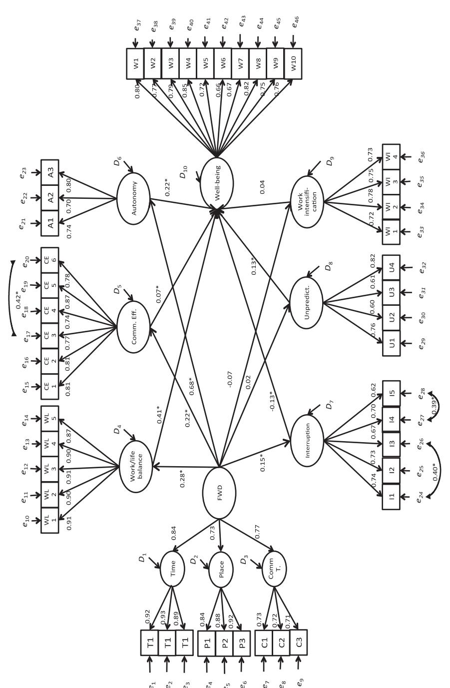

# Flexible work designs and employee well-being: examining the effects of resources and demands

## Claartje L. ter Hoeven and Ward van Zoonen

*Advances in communication technology continue to expand the possibilities for redesigning work environments to allow for temporal and spatial flexibility. Although flexible work designs (FWDs) are typically launched with high expectations, recent research shows that FWDs also pose challenges to employees and can even impede employee well-being. Based on the Job Demands–Resources model, we argue that FWDs offer both advantages (FWD-related resources) and challenges (FWDrelated demands) to employee well-being. The results (***n** *= 999) show that FWDs are related to employee well-being through several positive and one negative pathways. FWDs are positively associated with employee well-being through enhanced work/life balance, autonomy, and effective communication and negatively associated with employee well-being through increased interruptions. Thus, we introduce a framework that reveals the underlying positive and negative mechanisms in the relationship between FWDs and employee well-being.*

**Keywords:** flexible work designs (FWDs), job demands– resources (JD–R) model, employee well-being, communication technology use.

The work process is becoming more flexible (Grant and Parker, 2009; Parker, 2014). This flexibility is enabled and accompanied by technological developments that are frequently implemented by organizations (De Menezes and Kelliher, 2011; Putnam *et al*., 2014). FWDs provide employees latitude with respect to 'when they work (schedule flexibility), where they work (telecommuting), and via which communication medium (smart-phone, e-mail, videoconference) they work' (Ten Brummelhuis *et al*., 2012: 113). These changes in the organizational structure of work can alter work outcomes, including employee well-being (Grant *et al*., 2007; De Menezes and Kelliher, 2011; Michel, 2011; Moen *et al*., 2013; Parker, 2014).

However, the results of previous review studies are inconclusive about the relationship between FWDs and employee well-being (Golden, 2009; De Menezes and Kelliher,

Disclosure statement: The authors have no conflicts of interest to declare.

This is an open access article under the terms of the Creative Commons Attribution-NonCommercial-NoDerivs License, which permits use and distribution in any medium, provided the original work is properly cited, the use is non-commercial and no modifications or adaptations are made.

Claartje L. ter Hoeven (c.l.terhoeven@uva.nl) is Associate Professor of Corporate Communication at the Amsterdam School of Communication Research (ASCoR), University of Amsterdam. Her research interests include flexible work designs, communication technology use at work, and employee wellbeing. Ward van Zoonen (w.vanzoonen@uva.nl) is a PhD candidate in Corporate Communication at the Amsterdam School of Communication Research (ASCoR), University of Amsterdam. His research interests include communication technology use in the workplace.

2011; Allen *et al*., 2013). For example, De Menezes and Kelliher (2011) reported more studies that found no association between FWDs and well-being than studies that could confirm this relationship. One explanation might be that FWDs and employee well-being are associated through both the positive *and* the negative effects of FWDs, which is also called opposing mediation. Opposing mediation can undermine the finding of direct relationships when influences countervail one another. In other words, it is possible that a direct effect is near zero when two indirect effects that are approximately equal in size work in opposite directions. Therefore, this study examines the relationship between FWDs and employee well-being by considering the FWDrelated advantages and challenges embodied in this relationship. In this regard, the emotional component of well-being is considered, which is represented by positive affect (PA; Lyubomirsky *et al*., 2005). PA is characterized by positive emotional states, such as feeling energetic, motivated, happy and successful (Wardenaar *et al*., 2010). As PA engenders success in multiple life domains, including the workplace, it is generally considered the hallmark of well-being (Lyubomirsky *et al*., 2005; Avey *et al*., 2011).

FWDs result in both positive *and* negative effects for employees, such as enhanced autonomy and work intensification (Towers *et al*., 2006; Gajendran and Harrison, 2007; Chesley, 2010; Kelliher and Anderson, 2010; Chesley, 2014; Gajendran *et al*., 2015). Contemporary technology enables employees to access and exchange information efficiently across the boundaries of time and space, affording them greater control over their work during the day (Matusik and Mickel, 2011; Ten Brummelhuis *et al*., 2012; Cavazotte *et al*., 2014). This flexibility also provides employees with more autonomy to organize their work tasks in accordance with their preferences and to better coordinate their work and non-work activities (Kelly *et al*., 2011; Moen *et al*., 2011; Golden, 2013). However, FWDs can simultaneously lead to less favourable job conditions (Jarvenpaa and Lang, 2005; Thomas *et al*., 2006; Chesley, 2010; 2014; Kelliher and Anderson, 2010; Fonner and Roloff, 2012; Perlow, 2012) that can negatively affect work outcomes (Chesley, 2014; Derks and Bakker, 2014). For example, telecommuters' email usage can lead to stress from interruptions (Fonner and Roloff, 2012; Chesley, 2014). In addition, the capability of engaging in the instantaneous exchange of information that is associated with FWDs can lead to unpredictable work developments (Jarvenpaa and Lang, 2005; Thomas *et al*., 2006; Perlow, 2012). Other studies have found that FWDs may lead to a sense of obligation that employees reciprocate with additional effort, thereby intensifying work (Chesley, 2010; Kelliher and Anderson, 2010). Thus, FWDs can both benefit and strain employees simultaneously.

The literature has formulated different paradoxes, such as 'telecommuting paradox' (Gajendran and Harrison, 2007) and the 'connectivity paradox' (Fonner and Roloff, 2012), to capture the positive and negative impact of FWDs on employees (Rennecker and Godwin, 2005; Mazmanian *et al*., 2013; Putnam *et al*., 2014). A paradox is defined as 'contradictory yet interrelated elements that exist simultaneously and persist over time' (Smith and Lewis, 2011: 386). FWDs can lead to paradoxes by, for example, providing more freedom and control over work while simultaneously reducing the ability to disengage from work (Michel, 2011; Mazmanian *et al*., 2013; Putnam *et al*., 2014). Although several paradoxes where tested, quantitative research have yet to demonstrate a paradox as previous studies could only confirm one of the opposing pathways (e.g. Gajendran and Harrison, 2007; Fonner and Roloff, 2012). Additional research is necessary to understand the consequences of the simultaneously positive and negative impacts of FWDs for employee well-being.

The present study aimed to make three contributions. First, we introduce a conceptual model that integrates both advantages and challenges of FWDs that have been confirmed by previous studies. As these studies confirmed either the existence of FWD-related challenges or FWD-related demands, integrating these advantages and challenges in one model help to understand their relative strength in the FWD–employee well-being relationship. The FWD advantages that are confirmed in the literature include work/life balance (Gajendran and Harrison, 2007; Kelly *et al*., 2011; Moen *et al*., 2011), job autonomy (Gajendran and Harrison, 2007; Mazmanian *et al*., 2013; Gajendran *et al*., 2015) and communication effectiveness (Rennecker and Godwin, 2005; Chesley, 2010; Ten Brummelhuis *et al*., 2012). The FWD challenges that we find evidence for in the literature consist of interruptions (Fonner and Roloff, 2012; Chesley, 2014), unpredictability (Jarvenpaa and Lang, 2005; Thomas *et al*., 2006; Perlow, 2012), and work intensification (Towers *et al*., 2006; Chesley, 2010; Kelliher and Anderson, 2010). Second, to link FWDs and their associated advantages and challenges to employee well-being, we use the Job Demands–Resources (JD-R) model as the theoretical underpinning for our research (Demerouti *et al*., 2001). This model proposes that all job characteristics can be modelled using two categories: job resources and job demands. Job resources amplify and job demands curtail employee well-being (Hobfoll, 2002; Bakker *et al*., 2014). We argue that the FWD advantages and challenges that we identify are a specific set of FWD-related resources and demands that are linked to employee well-being. We hypothesize that both FWD-related resources and FWD-related demands must be considered to understand the relationship between FWDs and employee well-being. Third, we compare the opposing significant pathways to evaluate differences in the strengths of the effects of FWD-related resources and demands as they link to employee well-being. By contrasting the indirect effects, we can determine the magnitude of the different pathways with respect to one another to determine whether they outweigh one another. This is the first quantitative research to demonstrate the simultaneous and opposing pathways in the relationship between FWD and well-being; and show the differences in the effect magnitude between the opportunities and the challenges associated with FWDs.

## **Theoretical perspectives**

#### **FWDs and employee well-being: different paradoxes**

Individual and organizational contradictions often surface in the workplace flexibility literature (Putnam *et al*., 2014). The manner in which FWDs elicit contradictions can be conceptualized by oppositions such as job autonomy versus managerial control (Michel, 2011; Mazmanian *et al*., 2013), saving versus accelerating time (Wajcman, 2014) and career success versus career setback (Leslie *et al*., 2012). Consequently, continuing contradictions might lead to paradoxes (Putnam *et al*., 2014). A paradox consists of opposing, but interrelated elements that co-exist alongside one another (Smith and Lewis, 2011). A paradox results when the pursuit of a specific goal calls for or requires actions that are (partly) in opposition to that very goal (Stohl and Cheney, 2001: 354). For example, communication technology use saves time because of access to and the efficient exchange of information across physical and temporal boundaries, whereas it simultaneously causes stress by increasing the likelihood of interruptions and accelerating the pace of work and life (Chesley, 2010; 2014; Fonner and Roloff, 2012; Ten Brummelhuis *et al*., 2012).

Recently, three 'paradoxes' related to FWDs and their effect on work outcomes have been discussed in the literature: The 'telecommuting paradox' (Gajendran and Harrison, 2007), the 'connectivity paradox' (Leonardi *et al*., 2010; Fonner and Roloff, 2012) and the 'autonomy paradox' (Michel, 2011; Mazmanian *et al*., 2013; Putnam *et al*., 2014). First, the 'telecommuting paradox' assumes that telecommuting results in mutually incompatible consequences. Telecommuting has been understood to enhance perceived autonomy and work/life balance, but to negatively affect the quality of vital work relationships and career advancement; these characteristics have the opposite effects on work outcomes. Gajendran and Harrison's (2007) meta-analysis confirmed the link between telecommuting and work/life balance and enhanced job autonomy, but did not provide evidence regarding the decreased quality of work relationships or reduced opportunities for career advancements; thus, Gajendran and Harrison (2007) concluded that the telecommuting paradox is invalid.

Second, the 'connectivity paradox' proposed by Leonardi *et al*. (2010: 86) assumes that the use of data-intensive communication technologies enhances 'the quality, accuracy, and ease with which people can communicate over physical and temporal distances'. However, ease of connectivity can lead to expectations of constant connectivity, 'constructing a paradox for teleworkers who find the potential benefits of distributed work negated by the very technologies that made the arrangement possible'. Fonner and Roloff (2012) tested this proposition among teleworkers and confirmed one pathway: media use was negatively related to organizational identification because of interruption-related stress. Ten Brummelhuis *et al*. (2012) reported similar findings in their diary study: employees working under FWDs experienced more exhaustion because of increased interruptions.

Finally, the 'autonomy paradox' posits that the more freedom and autonomy that FWDs and technology offer, the more intensely employees work, and the more they feel controlled and constrained by their work (Michel, 2011; Mazmanian *et al*., 2013; Putnam *et al*., 2014). Numerous studies support the proposition that FWDs enhance effective and efficient communication (Jarvenpaa and Lang, 2005; Rennecker and Godwin, 2005; Chesley, 2010; Matusik and Mickel, 2011; Ten Brummelhuis *et al*., 2012; Golden, 2013; Mazmanian *et al*., 2013). In addition, FWDs offer a means to more job autonomy and work/life balance, which is consistent with their presumed intentions (Gajendran and Harrison, 2007; Michel, 2011; Moen *et al*., 2011; Gajendran *et al*., 2015). However, FWDs also result in work intensification (Towers *et al*., 2006; Chesley, 2010; Kelliher and Anderson, 2010; Michel, 2011) and Perlow (2012) found communication technology use invites more interactions. As employees incorporate more communication media into their work routine, their colleagues perceive them as more available and contact and/or interrupt them more often (Chesley, 2014), which results in employees remaining connected longer to monitor unpredictable work developments (Thomas *et al*., 2006; Matusik and Mickel, 2011; Cavazotte *et al*., 2014).

The advantages and challenges of FWDs that are confirmed by aforementioned studies indicate the manifestation of the autonomy paradox. However, these FWD advantages and challenges have yet to be integrated into one overarching conceptual model to understand their influence on employee well-being and to reveal their relative strength in the FWD—employee well-being relationship. The FWD-related advantages might be regarded as FWD-specific resources (e.g. telecommuting increases autonomy and work/life balance), whereas the FWD-related challenges might be understood as particular FWD demands (e.g. electronic communication use increases interruption-related stress) that are associated with employee well-being (e.g. Michel, 2011; Mazmanian *et al*., 2013; Putnam *et al*., 2014). To better understand the effects of FWDs on employee well-being, we must consider both these resources and demands. To this end, we employ the JD-R model as our theoretical basis.

#### **The JD-R model and flexible job designs**

The JD-R model assumes that every occupation has characteristics related to employee well-being and that each of these characteristics can be classified as either a job demand or a job resource. Job demands consist of physical, social or organizational aspects of a job that require sustained physical and/or mental effort, whereas job resources consist of the physical, psychological, social or organizational aspects of a job that function either to achieve work goals, reduce job demands, or stimulate personal growth and development (Demerouti *et al*., 2001). Work pressure and information overload are examples of typical job demands, whereas typical job resources are job autonomy and social support (Bakker *et al*., 2014). According to the JD-R model, job demands and job resources both induce another process: Whereas job demands can deplete employees and result in health-related problems, job resources enhance motivation, enjoyment and absorption at work (Bakker *et al*., 2003b; 2004). Numerous empirical studies have supported this claim and report that job demands often lead to exhaustion, diminished task effectiveness, increased burnout and longer and more frequent sick leaves (Bakker *et al*., 2003a; 2004; 2014; Ten Brummelhuis *et al*., 2011b). In turn, job resources such as autonomy and social support are related to enhanced dedication, increased commitment, reduced disengagement, and lower levels of burnout and absenteeism (Crawford *et al*., 2010; Nahrgang *et al*., 2011; Ten Brummelhuis *et al*., 2011b; 2013). These results support the theoretical assumption that job demands drain and job resources increase employee well-being (Demerouti *et al*., 2001; Hobfoll, 2002; Bakker *et al*., 2014). In other words, job demands and job resources generate different processes that decrease or enhance employee well-being, respectively.

The general working conditions—job demands and job resources—that are described by the JD-R model seem to correspond with the advantages and challenges that FWDs induce (Gajendran and Harrison, 2007; Kelliher and Anderson, 2010; Fonner and Roloff, 2012; Perlow, 2012; Ten Brummelhuis *et al*., 2012; Chesley, 2014; Putnam *et al*., 2014). As such, the insights from the JD-R model allow us to accommodate the opposing effects of FWDs in a single model to study the effects of FWDs on employee well-being. We expect that FWD characteristics not only lead to more resources for employees, but also strain employees' well-being through demands related to this particular work design. FWD-related resources and FWD-related demands are derived from the aforementioned literature on paradoxes in the context of FWDs (Rennecker and Godwin, 2005; Gajendran and Harrison, 2007; Fonner and Roloff, 2012; Mazmanian *et al*., 2013; Putnam *et al*., 2014).

#### *FWD-related resources*

We argue that work/life balance, autonomy, and effective communication are resources that are associated with FWDs. Many studies have considered the relationship between flexible work environments and the work/life interface. Employees who report more control over their work schedules experience increased work/life balance based on the possibility to accommodate both work and non-work responsibilities (Gajendran and Harrison, 2007; Kelliher and Anderson, 2008; Kelly *et al*., 2011). Experiencing the flexibility to adjust different life responsibilities in a balanced manner helps employees achieve work goals and accommodate job demands. Work/life balance is the 'overall level of contentment resulting from an assessment of one's degree of success at meeting work and family role demands' (Valcour, 2007: 1512). Moen *et al*. (2011) show that schedule flexibility and reduced work–family conflict foster employee well-being.

An increased feeling of autonomy is considered an FWD-related resource and is induced by control over work schedule (Kelly *et al*., 2011; Putnam *et al*., 2014), work location (Gajendran and Harrison, 2007; Kelliher and Anderson, 2008), and the use of communication technologies (Mazmanian *et al*., 2013). Autonomy refers to the organizationally mediated possibilities for workers to make decisions about their work (Karasek *et al*., 1998). Obtaining the freedom to decide when and where to work leads to self-reliance in scheduling particular tasks and increased control over the means of completing them (Gajendran and Harrison, 2007). Therefore, workplace flexibility is associated with increased feelings of autonomy (Hackman and Oldham, 1976; Kelliher and Anderson, 2008). Autonomy is also the primary mechanism facilitating the relationship between telecommuting and several work outcomes (Gajendran and Harrison, 2007).

The final FWD-related resource we consider is communication effectiveness. FWDs are facilitated by advanced communication technologies that enable employees to communicate more efficiently over temporal and spatial boundaries (Jarvenpaa and Lang, 2005; Rennecker and Godwin, 2005; Chesley, 2010; Matusik and Mickel, 2011; Mazmanian *et al*., 2013; Cavazotte *et al*., 2014). Communication effectiveness is defined as the effectiveness of horizontal and vertical communication regarding work-related issues, providing control over information and interaction (Rennecker and Godwin, 2005; Mazmanian *et al*., 2013). Chesley (2010) showed that more frequent use of communication technology increased the experience of work effectiveness. This finding is strengthened by qualitative studies that more specifically address the effectiveness of communication. Cavazotte *et al*. (2014) discussed lawyers who use mobile devices provided by their company. The lawyers appreciated the device because it facilitated effective communication with clients and colleagues. Matusik and Mickel (2011) and Mazmanian *et al*. (2013) both reported similar findings from different occupational settings. The diary study of Ten Brummelhuis *et al*. (2012) showed that effective communication increased work engagement and reduced feelings of exhaustion. We posit that work/life balance, autonomy, and effective communication can be considered FWD-related resources and as such affect employee well-being. Therefore, we hypothesize as follows:

Hypothesis 1a: FWDs are positively related to employee well-being through enhanced work/life balance.

Hypothesis 1b: FWDs are positively related to employee well-being through enhanced job autonomy.

Hypothesis 1c: FWDs are positively related to employee well-being through more effective communication.

#### *FWD-related demands*

FWD-related demands include increased interruptions, unpredictable work developments, and work intensification (Thomas *et al*., 2006; Chesley, 2010; 2014; Kelliher and Anderson, 2010; Fonner and Roloff, 2012; Perlow, 2012; Ten Brummelhuis *et al*., 2012). Communication technologies make workplace flexibility possible but also provide different channels to interrupt employees in their work processes (Fonner and Roloff, 2012; Ten Brummelhuis *et al*., 2012; Chesley, 2014). An interruption is regarded as 'a synchronous interaction which is not initiated by the recipient, is unscheduled, and results in the recipient discontinuing their current activity' (Rennecker and Godwin, 2005: 250). Fonner and Roloff (2012) indicated that teleworkers' increased use of communication technologies prevents them from sustaining a sense of distance from co-workers and clients and induces interruption-related stress. Chesley (2014) demonstrated that the use of information and communication technologies for work increases health-related problems by increasing interruptions and stress (see also Baethge *et al*., 2015).

Several studies associate FWDs with an accumulation of unpredictable demands by allowing and encouraging instantaneous information exchange and requests across time and space (Jarvenpaa and Lang, 2005; Thomas *et al*., 2006; Perlow, 2012). Thomas *et al*. (2006) studied whether and how email use contributed to unpredictable work developments and concluded that 'recipients may be exposed to unstable requests more often and iteratively because the nature of the medium allows organizational members to send requests easily, quickly, and absent any feedback from receivers' (p. 266). Jarvenpaa and Lang (2005) and Perlow (2012) addressed this issue with regard to mobile devices, describing how technology enhances the unpredictability and uncertainty of incoming messages, possibly counteracting the convenience that employees derive from the devices. Employees often monitor their mobile devices until they go to bed, to make sure that they stay up to date with the latest work developments (Matusik and Mickel, 2011). The accumulation of unanticipated and unpredictable tasks can reduce energy and result in a longer and more exhausting workday (Derks and Bakker, 2014).

Intensification of work is regarded as an FWD-related demand, driven by increased work hours, the experience of intensified effort, and the perceived expectation that flexibility should be reciprocated with extra effort (Towers *et al*., 2006; Kelliher and Anderson, 2010). Work intensification is defined as the extent to which employees feel forced to work faster and harder than they have before (Burchell, 2002). Kelliher and Anderson (2010) found that workplace flexibility increased work intensification in several ways: Employees who had reduced their working hours ended up working extra hours and remote workers experienced more intensified efforts. Both groups (those with reduced hours and remote workers) felt that they had to reciprocate the flexibility that was offered to them by intensifying their work. With regard to the communication technology facet of FWDs, both Chesley (2010) and Towers *et al*. (2006) demonstrated that the use of communication technologies leads to work intensification because of the possibility to extend work to the home domain, among other reasons. In a longitudinal study, Michel (2011) found that sustained work intensification contributed to deteriorating physical well-being. As such, the FWD-related demands of increased interruptions, unpredictability, and work intensification are predicted to affect the FWD–well-being relationship:

Hypothesis 2a: FWDs are negatively related to employee well-being through increased interruptions.

Hypothesis 2b: FWDs are negatively related to employee well-being through increased unpredictability.

Hypothesis 2c: FWDs are negatively related to employee well-being through increased work intensification.

## **Method**

#### **Sample and procedure**

In this study, 1,005 Dutch employees participated in a voluntary and anonymous Dutch web-based questionnaire administered by a data collection firm in the Netherlands. Respondents worked at least 20 hours per week in an organization with at least 50 employees. Six employees were removed from our sample because of incomplete questionnaires or concerns regarding employment (self-employed). Of the remaining 999 respondents, 43 per cent were female. The average age of the respondents was 42.94 years [standard deviation (*SD*) = 10.92), and 36 per cent had a higher education degree, thereby representing the actual Dutch workforce. The sample is also representative in terms of average working hours per week of the Dutch workforce (33.07)—our respondents indicated that they worked 35.67 hours per week (*SD* = 8.37).1 In total, 27 per cent of the participants were managers.

#### **Measures**

All variables in the model were measured by multiple indicators of three to 10 items each, based on 5-point Likert scales. Table 1 includes descriptive statistics, bivariate correlations and alpha coefficients (α range 0.75–0.95).

*Employee well-being*

PA was measured to represent the emotional component of well-being. PA is regarded as 'the hallmark of well-being' because it engenders success in multiple life domains, including the workplace (Lyubomirsky *et al*., 2005: 803). PA reflects the extent to which a person feels '*optimistic*', '*energetic*', '*happy*' and '*successful*' and was measured with the 10 PA items of the Mood and Anxiety Symptom Questionnaire (Wardenaar *et al*., 2010). Employees were asked to indicate the extent to which they experienced certain feelings in the past week, including the day they took the survey. The scale included items such as, '*I felt optimistic*' and '*I felt successful*'. The factor loadings ranged from 0.66 to 0.85.

#### *FWDs*

FWDs refer to the flexibility employees experience with respect to when they work, where they work, and the communication medium through which they work (Ten Brummelhuis *et al*., 2012: 113), this was measured using three sub-dimensions flexibility of time, flexibility of place, and use of communication technologies—of the New Ways of Working scale (Ten Brummelhuis *et al*., 2011a). These sub-dimensions consisted of three items each and together formed the second-order construct FWDs. A sample item for flexibility in time was, '*I can decide the time slots I work in*'; flexibility in place was measured using items such as, '*I can choose at which location I work*'. The use of the communication technology construct included the following: '*I can decide as to*

*Table 1: Descriptive statistics, correlations and alpha coefficients*

| Variable                       | D) M (S        | 1      | 2      | 3     | 4      | 5      | 6     | 7      | 8     | 9      | 10     | 11     | 12    | 13 |
|--------------------------------|-------------------|--------|--------|-------|--------|--------|-------|--------|-------|--------|--------|--------|-------|----|
| D W 1. F                 | 2.30 (0.92)       | 0.8    |        |       |        |        |       |        |       |        |        |        |       |    |
| Work/life balance 2.        | 3.57 (0.81)       | 0.29*  | 0.95   |       |        |        |       |        |       |        |        |        |       |    |
| my 3. Job autono            | 3.06 (1.01)       | 0.67*  | 0.34*  | 0.79  |        |        |       |        |       |        |        |        |       |    |
| m. effectiveness m 4. Co | 2.33 (0.79)       | 0.25*  | 0.14*  | 0.15* | 0.9    |        |       |        |       |        |        |        |       |    |
| 5. Interruptions               | 2.99 (0.80)       | 0.14*  | −0.21* | 0.13* | 0.09*  | 0.84   |       |        |       |        |        |        |       |    |
| 6. Unpredictability            | 3.41 (0.79)       | 0.02   | 0.09*  | 0.08  | 0.06   | 0.66*  | 0.79  |        |       |        |        |        |       |    |
| Work intensification 7.     | 2.98 (0.83)       | −0.03  | −0.25* | −0.06 | 0.08*  | 0.53*  | 0.64* | 0.83   |       |        |        |        |       |    |
| mployee well-being 8. E     | 2.94 (0.92)       | 0.35*  | 0.34*  | 0.34* | 0.16*  | −0.08* | 0.05  | −0.05  | 0.93  |        |        |        |       |    |
| ment position Manage 9.  | 1.27 (0.43)       | 0.25*  | −0.03  | 0.29* | 0.10*  | 0.08*  | 0.03  | 0.08*  | 0.09* | —      |        |        |       |    |
| 10. Age                        | 42.94 (10.92)     | −0.03  | 0.10*  | 0.03  | −0.21* | −0.04  | 0.01  | −0.07* | −0.02 | −0.03  | —      |        |       |    |
| 11. Gender                     | 1.43 (0.50)       | −0.11* | 0.05   | −0.05 | −0.05  | 0.03   | 0.03  | 0.08*  | 0.03  | −0.19* | −0.12* | —      |       |    |
| 12. Organization size          | 3139.44 (9274.63) | 0.05   | 0.03   | −0.02 | 0.02   | −0.02  | 0.02  | −0.08* | 0.03  | −0.03  | 0.03   | −0.10* | —     |    |
| w Working hours p/ 13.   | 35.67 (8.37)      | 0.17*  | −0.07* | 0.09* | 0.09*  | 0.07*  | 0.13* | 0.08*  | 0.04  | 0.22*  | −0.05  | −0.39* | 0.07* | —  |

*Notes*: *n* = 999. Values in parentheses are standard deviation; values on the diagonal in bold are reliabilities (α). \**p* < .05. FWD, flexible work design; SD, standard deviation

*when I send or reply to emails*'. Factor loadings on the sub-dimensions ranged from 0.70 to 0.93. The factor loadings of the sub-dimensions on the second-order construct FWDs ranged from .75 to .92.

#### *FWD resources*

The level of satisfaction that employees experienced with their work/life balance was measured by five items (Valcour, 2007: 1517). Employees were asked, '*How dissatisfied/ satisfied are you with* . . .' followed by a phrase such as, '*the way you divide your attention between work and home*'. The factor loadings for the items in this scale ranged from .87 to 0.91. The measurement of autonomy was based on the Decision Authority Scale—for example '*do you have freedom in carrying out your work?*' (see the Job Content Questionnaire, JCQ; Karasek *et al*., 1998). The factor loadings of these items ranged from .70 to .80. The effectiveness of communication was measured using a scale that evaluates organizational communication about work tasks (Dinsbach *et al*., 2007: 731). Six items tap into the effectiveness of communication at work and involve—for example '*skill improvement*', '*the best way to perform certain tasks*', '*personal performance*', and '*preventing mistakes at work*'; the factor loadings of these items range from 0.74 to 0.87.

#### *FWD demands*

The measurement of work intensification was based on four items derived from the JCQ workload scale (Karasek *et al*., 1998), which measures work pace and overload. The items on this scale included, '*Do you need to work hard?*' and the factor loadings range from .72 to .77. The notion of unpredictable work developments was based on Perlow (2012), and we constructed a four-item scale to measure the degree of unforeseen tasks. The factor loadings on the scale, with items such as, '*At work, unexpected tasks can be added to my responsibilities at any time*', range from .60 to .82. Likewise, we created a five-item scale to measure interruptions that employees experience during a workday; for example '*I am often interrupted during my work*', and the factor loadings range from 0.62 to 0.74. Because the latter two scales and the FWD constructs have not been previously validated, we cross-validated these constructs with an independent sample. The results are presented with the discussion of our CFA model.

### *Control variables*

We took several control variables into account. Gender was measured as a dichotomous variable (1 = male; 2 = female) and age as a continuous variable. The work characteristics that were considered included managerial position (0 = no management position; 1 = management position), hours worked per week, and the size of the organization, which were measured as continuous variables.

#### **Analysis**

Structural equation modelling (SEM) is a confirmatory approach to data analysis for analyzing fully latent structural models with (multiple) mediations (Kline, 2011). To gauge the fit of the hypothesized model to the data, we present both incremental—that is the Tucker–Lewis index (TLI) and the comparative fit index (CFI)—and absolute fit indices—that is the root mean squared residual (SRMR) and the root mean square of approximation (RMSEA). The χ2 statistic is reported as a relative measure to evaluate model fit improvement after model re-specification and between the retained and alternative or nested models using a Δχ2 test (Hu and Bentler, 1999; Kline, 2011).2

We extracted 2,000 bootstrap samples from the data to calculate all parameter estimates and confidence intervals. Bootstrapping computes accurate confidence intervals for parameter estimates of indirect effects (x → m → y) and does not impose the assumption of normality on the sampling distribution (Kline, 2011). The null hypothesis that x has no indirect effect on y through m is rejected when the confidence interval does not include zero.

## **Results**

#### **Multivariate assumption and common method variance**

Curve estimations for all the relationships in our model show that all relationships are linear and could thus be tested using a covariance-based algorithm. Because we rely on cross-sectional data, additional analyses were conducted to establish the degree of common method bias. Squared regression estimates indicated that common method bias was 13.7 per cent. Next, we used the CFA marker technique by adding the marker variable, 'major life events'. Following this analysis, the common method variance dropped to 10.9 per cent. These results indicate that common method variance is not of substantial concern to our data.

## **CFA measurement model**

Our initial measurement model suggested unsatisfactory model fit: χ2 (1,096) = 3,462.93; CFI = 0.92; TLI = 0.91; SRMR = 0.06 and RMSEA = 0.047 (CI: 0.045, 0.048). The following model improvements were made consecutively. First, three indicators that load on multiple constructs and have low factor loadings on their intended constructs were discarded. One indicator of autonomy (referring to time: 'Are you able to schedule your own time?') was discarded based on low discriminant validity. Similarly, one indicator of work intensification ('Are you often interrupted?') loaded on interruptions and had a relatively low factor loading on its intended construct (.589). Finally, one indicator of unpredictability ('It is difficult to determine when to be ready for my work') loaded on work intensification, autonomy and interruptions and had a low factor loading on its intended construct (.350). These items lack both convergent and discriminant validity. These alterations significantly improved the model fit [Δχ2 (138) = 898.83, *p* < 0.001]. Second, we added three error correlations between indicators within the same construct, as illustrated by the Lagrange multiplier (LM) test. Specifically, we added an error correlation between two indicators of communication effectiveness and two error correlations between indicators of interruptions (see Figure 1). This set of alterations decreased the overall model χ2 by 398.30. The final measurement model achieves good model fit: χ2 (955) = 2,165.80; CFI = 0.96; TLI = 0.96; SRMR = 0.05 and RMSEA = 0.036 (CI: 0.034, 0.038).

The measurement model was examined by assessing discriminant and convergent validity. Discriminant validity was assessed by examining cross-factor correlations. The highest between-factor correlation was 0.66 between interruptions and unpredictability, which is not surprising. All other correlations ranged from −0.25 to 0.64 (see Table 1), which demonstrates the distinctiveness of the latent constructs in the model (Kline, 2011). All loadings on the intended latent constructs were significant and sizable. The factor loadings ranged from 0.60 to 0.93 (see Figure 1), which indicates satisfactory convergent validity. Thus, the retained measurement model adequately measures all latent constructs, indicating that further examination of the structural model is justified.

The measurements for the FWDs, interruptions, and unpredictability, have not been previously validated. As such, we conducted a second study to cross-validate these scales using an independent sample of Dutch workers (*n* = 404). Our participant sample was 51.7 per cent female; on average, our participants worked 34.06 hours per week (*SD* = 8.13) and were 44.4 years old (*SD* = 11.92). The CFA model shows good model fit: χ2 (127) = 296.62; CFI = 0.96; TLI = 0.95; SRMR = 0.06 and RMSEA = 0.058 (CI: 0.049, 0.066). All factor loadings were between 0.59 and 0.94 on the intended latent construct. Correlations between latent factor FWDs and interruptions and FWDs and unpredictability are 0.22 and 0.14, respectively. The correlation between interruptions and unpredictability is 0.74. These results support the validity of the scales developed to measure FWDs (*α* = 0.79) and the scales used to measure interruptions (*α* = 0.85) and unpredictability (*α* = 0.78).

*Figure 1:* Latent structural model: linking flexible work designs (FWDs) to employee well-being *Notes*: *n* 999. Significance levels are flagged \**p* < 0.05. Factor loadings are all significant at *p* < 0.001. The model included correlations between the disturbance terms of resources (d4–d6) and demands (d7–d9), but these are not shown here for sake of clarity.

*Table 2: Hypotheses testing: Indirect pathways between FWD and well-being*

|                                    |                                        | Bootstrapping |       | BC 95% CI |        |       |
|------------------------------------|----------------------------------------|---------------|-------|-----------|--------|-------|
|                                    |                                        | Estimate      | SE    | Lower     | Upper  | p     |
|                                    | Indirect effect x → m → y        |               |       |           |        |       |
| H1a                                | Work/life balance                      | 0.104         | 0.019 | 0.068     | 0.142  | 0.002 |
| H1b                                | Autonomy                               | 0.132         | 0.026 | 0.085     | 0.190  | 0.001 |
| H1c                                | Communication effectiveness            | 0.015         | 0.007 | 0.003     | 0.030  | 0.014 |
| H2a                                | Interruptions                          | −0.017        | 0.008 | −0.039    | −0.005 | 0.004 |
| H2b                                | Unpredictability                       | 0.002         | 0.006 | −0.006    | 0.019  | 0.463 |
| H2c                                | Work intensification                   | −0.003        | 0.004 | −0.014    | 0.002  | 0.253 |
| Contrastsa                         |                                        |               |       |           |        |       |
| Communication effectiveness versus |                                        | −0.003        | 0.011 | −0.024    | 0.013  | 0.714 |
| interruptions                      |                                        |               |       |           |        |       |
|                                    | Work/life balance versus interruptions | 0.087         | 0.022 | 0.052     | 0.124  | 0.001 |
|                                    | Autonomy versus interruptions          | 0.115         | 0.026 | 0.075     | 0.164  | 0.001 |
|                                    |                                        |               |       |           |        |       |

*Notes*: Entries represent unstandardized coefficients. *n* = 999. Where the CI includes zero we fail to reject the null hypothesis (H0 = there is no effect of FWD on well-being through the mediator). a Contrasts reflect comparisons of effect sizes of indirect effects including confidence intervals. Indirect effects and path comparisons are listed by the mediating variable.

BC, bias corrected; CI, confidence interval; FWD, flexible work design; SE, standard error.

## **Hypotheses testing**

#### **Structural model**

The initial structural model suggested mediocre model fit, χ2 (971) = 2,971.63; CFI = 0.93; TLI = 0.93; SRMR = 0.10 and RMSEA = 0.045 (CI: 0.044, 0.047). By allowing the three FWD-related resources to correlate—in addition to the three FWD-related demands—as indicated by the LM test, model fit was improved [Δχ2 (6) = 698.69, *p* < 0.001]. The retained model shows good model fit: χ2 (965) = 2,272.94; CFI = 0.96; TLI = 0.95; SRMR = 0.05 and RMSEA = 0.037 (CI: 0.035, 0.039).

#### **Model presentation**

The final model with standardized estimates is shown in Figure 1. Table 2 presents the bootstrapping results for all indirect pathways and discloses the mechanisms that enable the relationships between FWD and employee well-being. We found that FWDs yield a significant and positive indirect effect on employee well-being through work/ life balance (b\* = 0.104, *p* = 0.002), as hypothesis 1a predicts. Other positive relationships between FWD and well-being are enabled by two FWD-related resources, job autonomy (b\* = 0.132, *p* = 0.001) and communication effectiveness (b\* = 0.015, *p* = 0.014), thereby supporting hypotheses 1b and 1c. Moreover, the relationship between FWD and well-being is also driven by FWD-related demands. We found that FWD was negatively related to well-being through interruptions (b\* = −0.017, *p* = 0.004), supporting the reasoning reflected in hypothesis 2a. The indirect effects of FWDs on well-being through unpredictability (b\* = 0.002, *p* = 0.463) and work intensification (b\* = −0.003, *p* = 0.253) were not significant. Thus, the null hypothesis that FWD has no effect on well-being through unpredictability (H2b) and work intensification (H2c) cannot be rejected. In sum, the model explains 29.4 per cent of the variance in employee well-being.

New Technology, Work and Employment published by John Wiley & Sons Ltd

#### **Contrasting effects**

A *post hoc* analysis was performed to test the relative strengths of the opposing indirect pathways. Specifically, effect sizes for significant indirect effects are examined using pairwise comparisons to determine which of the opposing paths has more credence. The contrasting estimate represents the difference in effect size in which the estimate should significantly differ from zero to denote a difference in the magnitude of the effect.

When these indirect effects through communication effectiveness and interruptions are compared, the following non-significant point estimate appears (b\* = −0.003, BC95% [−.024; .013], *p* = 0.748). This indicates that the indirect effect through communication effectiveness and the indirect effect through interruptions counteract one another.

The indirect effect through work/life balance was significantly stronger than the indirect effect through interruptions (b\* = 0.087, BC95% [.052; .124], *p* = 0.001). Similarly, the indirect effect through autonomy is significantly stronger than the effect through interruptions (b\* = 0.115, BC95% [.075; .164], *p* = 0.001). Thus, the two FWDrelated resources work/life balance and autonomy are dominant in opposition to interruptions in the relationship between FWDs and well-being (see Table 2).

#### **Control variables and alternative models**

Control variables for gender, age, managerial position, working hours per week, and organization size were modeled consecutively. All the parameters estimated in the final model held when controlling for these variables, which indicates that the control variables had no influence on the overall findings. These variables were excluded from the final model due to parsimony.

Alternative models were examined to determine whether such models have acceptable correspondence to the data with alternative explanations. First, we re-specified our structural model as a CFA model. This model represents the non-directional unanalyzed associations between factors (i.e. covariances). Model fit indices suggest significant model deterioration as opposed to the retained structural model (Δχ2 = 83.87, *p* < 0.001). In addition, we estimated a reversed model, which suggests that employee well-being could theoretically predict the extent to which employees adopt FWDs, thus reversing the causal directionalities. Nevertheless, the overall fit of the reversed model suggests an inferior model fit (Δχ2 = 6.58, *p* < 0.010).

## **Discussion**

Literature involving FWDs and employee well-being has thus far yielded inconclusive results (Golden, 2009; De Menezes and Kelliher, 2011; Allen *et al*., 2013). In line with previous studies on FWD-related paradoxes, we seek to explain these results in the underlying opposing mechanisms that characterize the relationship between FWDs and employee well-being (Gajendran and Harrison, 2007; Michel, 2011; Fonner and Roloff, 2012; Mazmanian *et al*., 2013; Putnam *et al*., 2014). Based on the JD-R model, we introduce a model that captures both the resources and demands associated with FWDs as opposing mechanisms in the relationship between FWDs and employee well-being. We find that FWDs and employee well-being are positively associated through enhanced work/life balance, greater autonomy, and more effective communication and negatively related through interruptions.

#### **Theoretical implications**

This discussion begins with a reflection on the findings, relating them to the extant literature and underlining the contributions of this study. First, our findings confirm that there are opposing mechanisms embodied in the FWD–well-being relationship. In particular we found that one of three FWD demands, interruptions, acts as a mediator. Simultaneously, the FWD-related resources—work/life balance, autonomy, and communication effectiveness—also act as mediators and are generally dominant. These findings represent a paradox as these opposing effects are interrelated elements that coexist. However, this paradoxical effect cannot be attributed to any of the previously described paradoxes (Gajendran and Harrison, 2007; Michel, 2011; Fonner and Roloff, 2012; Mazmanian *et al*., 2013; Putnam *et al*., 2014). The 'telecommuting paradox' and the 'connectivity paradox' were only partly supported, the first confirming its proposed positive pathways (autonomy and work/life balance) and the latter confirming its proposed negative pathway (interruptions). The 'autonomy paradox' has been found in extensive qualitative research (Michel, 2011; Mazmanian *et al*., 2013), but could only be partly confirmed here. In Michel (2011), enhanced autonomy and work/life balance were important aspects of the adopted values of two investment banks, but their less visible controls caused constant overwork, which affected the health of the bankers after several years, see also Putnam *et al*. (2014) and Mazmanian *et al*. (2013). In our study, however, we could not find any effects of work intensification. An explanation for these results could be the self-chosen character of overwork in flexible workplaces (Kelliher and Anderson, 2010; Michel, 2011; Mazmanian *et al*., 2013), which in turn, reduce the perceived intensity of the work. The absence of any relationship between work intensification and well-being might be explained by the delayed effects of overwork on well-being, which has been found by Michel (2011) in a longitudinal study, since we did not measure long-term effects. The paradoxical effects found in our study are a synthesis of the previously studied paradoxes (primarily the telecommuting and connectivity paradoxes); thus, confirming the opposing pathways of FWDs and, in addition, to relate them to employee well-being.

Second, we used the JD-R model to link FWDs and its advantages and challenges to employee well-being. Under the JD-R model, job resources and demands are two sets of working conditions that are related to employee well-being (Demerouti *et al*., 2001). We assumed that particular job designs are also equipped with related resources and demands that belong to that specific arrangement. Our findings show that work/life balance, autonomy, and effective communication can all be regarded as FWD-related resources. With regard to FWD-related demands, we found that experiencing interruptions was positively related to FWDs. As we did not find a relationship between FWDs and unpredictability and work intensification, we cannot confirm that these two should be considered an FWD-related demand. For unpredictability, we found contrary to our hypothesis—a positive association with employee well-being. Unpredictability could offer employees the chance to thrive, excel, and even surpass their peers by exceeding their job descriptions. Handling unforeseen tasks can increase confidence and lead to satisfactory (self-) job performance evaluations and assessments of well-being. This is similar to the idea of challenge demands as proposed by Crawford *et al*. (2010). However, unpredictability cannot be regarded as an FWDrelated challenge demand, as we did not find an association with FWDs.

Third, this study demonstrates the difference in effect strength of FWD-related resources compared with the strength of the effect of interruptions in the relationship between FWDs and well-being. As such, we can conclude that the opposing pathways through communication effectiveness and interruptions were not significantly different in strength, which indicates opposing mediation. The opposing pathways of communication effectiveness and interruptions most closely relate to paradoxes involving the use of communication technology for work, such as the self-perpetuating paradox of technology use (Rennecker and Godwin, 2005) that refers to similar mechanisms. Our study indicates that the benefits of communication effectiveness for employee well-being are outweighed by the disadvantages caused by increased interruptions (Towers *et al*., 2006; Mazmanian *et al*., 2013). Apparently, FWDs expose employees to an accumulation of questions, messages, and/or interactions that can interfere with their work routines and deplete their energy reserves (Derks and Bakker, 2014; Baethge *et al*., 2015).

Finally, these contrasting effects demonstrate that the pathways involving the FWD resources work/life balance and autonomy are stronger in effect size than the FWD demand interruptions in the FWD–well-being relationship. The JD-R model offers a possible explanation for this finding that describes two distinct processes evoked by resources and demands; the motivational process and the health impairment process. The central notion is that job resources are the most important predictors of motivational concepts, such as commitment and work engagement, and that job demands are the main antecedents of health problems, such as exhaustion and (psychosomatic) health issues (Crawford *et al*., 2010; Nahrgang *et al*., 2011; Bakker *et al*., 2014). Although there is strong evidence for the cross-paths that link job resources to health constructs and job demands to motivational concepts (Crawford *et al*., 2010; Nahrgang *et al*., 2011), the dominance of FWD resources over FWD demands in our study might be assigned to the motivational process, since our operationalization of well-being is more motivational in nature than physical. Based on these two processes, it might be argued that the effect strengths of FWD resources over FWD demands could be the opposite of what we found if we used a more health-related measure of employee well-being, such as burnout (Bakker *et al*., 2014).

#### **Practical implications**

Our findings show that FWDs create opportunities for better work/life balance, increased job autonomy, and more effective communication. Therefore, it is no surprise that FWDs improve employee well-being. However, the downside is that FWDs are also negatively associated with employee well-being due to increased interruptions. The challenge for interruption problems is to find a balance among flexibility, connectivity, and effectiveness (Mazmanian, 2013; Mazmanian *et al*., 2013). Whether finding this balance is an individual or organizational responsibility is a matter of debate. Solutions primarily focused on the individual—such as 'better work, sleep, eat, and exercise' or flexible work accommodations that purport to help individuals balance work and family demands—appear to be inadequate (Michel, 2011; Perlow and Kelly, 2014; Putnam *et al*., 2014). Recently, scholars have focused on solutions specifically aimed at altering the structure and culture of work to facilitate better work and better lives (Perlow and Kelly, 2014; Putnam *et al*., 2014). Because our findings illustrate that the most challenging part of FWDs involve increased interruptions, the following finding from Mazmanian (2013) seems worth addressing. Mazmanian (2013: 1246) has shown 'that in certain scenarios it is possible for individuals to develop socially stable heterogeneous patterns of communication that benefit them without having received a top-down mandate, such as a 'no e-mail Friday'. Therefore, it would be useful for organizations to understand the social origins and social solutions of interruptions in the context of FWDs. Organizations can learn to create congruent frames of heterogeneous communication practices and develop communication norms to circumvent the trap of constant connectivity (Mazmanian, 2013).

#### **Limitations and future research**

We relied on cross-sectional data, which makes verifying causal relationships difficult. In theory, it is possible that highly engaged and energetic employees are granted more flexibility at work, but this explanation seems unlikely because the respecified model and the reversed model that we tested showed significantly poorer model fit, which indicates that the assumed causality fit the data best. Nevertheless, more research is required to confirm the direction of the relationship between FWDs and well-being. Experimental and longitudinal research can improve the ability to infer causal relationships reliably. Furthermore, we based our measurements on online self-reports taken the same day. Future studies might benefit from multiple-source data to reduce the effects of common method bias, which might be implemented by including supervisor or colleague assessments of certain aspects of employee well-being (social well-being).

The relationship between FWDs and employee well-being might also be explained by certain conditions and additional personal and organizational characteristics. For instance, organizational culture and/or management could be more or less supportive of workplace flexibility, and employees might differ in their ability to adapt to this specific job design. Additional characteristics that might influence the overall findings could be job level and family composition (Bailey and Kurland, 2002). Also, it should be noted that some of the pathway coefficients were rather small; however, associations that are theoretically distal, such as the relationship between working conditions and a general measure of well-being, are typically small (Shrout and Bolger, 2002). As we used a measure for general well-being, multiple life domains will influence this construct.

We could not confirm the propositions and previous results with respect to the indirect effect through work intensification upon which we built our hypothesis (Towers *et al*., 2006; Chesley, 2010; Kelliher and Anderson, 2010). The discrepancies between those previous findings and ours might be due to different conceptualizations of FWDs. Because there are many indications that work intensifies as the result of implementing FWDs (Towers *et al*., 2006; Matusik and Mickel, 2011; Michel, 2011; Perlow, 2012; Mazmanian *et al*., 2013; Cavazotte *et al*., 2014) and subsequently influences well-being (Michel, 2011; Chesley, 2014), we urge researchers to continue studying this subject as an FWD demand, perhaps by changing the operationalization of work intensification (Macky and Boxall, 2008).

Finally, although we believe that we captured the most important FWD-related resources and demands, we do not claim to be exhaustive. Moreover, specific flexible contexts and emerging knowledge regarding FWDs might call for the incorporation of other FWD-related resources and demands. To expand our knowledge regarding the relationship between FWDs and employee well-being, we encourage research to explore other (paradoxical) processes in this relationship.

## **Acknowledgements**

The authors would like to thank Debra Howcroft, Philip Taylor and the two anonymous reviewers for their insights and suggestions. This work was supported by The Netherlands Organization of Scientific Research under Grant number 451-13-012.

### **Notes**

- 1. Figures derived from the central bureau of statistics (statline.cbs.nl/) and the Dutch ministry of education, culture and science (http://goo.gl/doVy58).
- 2. A more full-fledged discussion regarding model fit statistics is available from the first author upon request.

#### **References**

- Allen, T.D., R.C. Johnson, K. Kiburz and K.M. Shockley (2013), 'Work-Family Conflict and Flexible Work Arrangements: Deconstructing Flexibility', *Personnel Psychology* **66**, 2, 345–376.
- Avey, J.B., R.J. Reichard, F. Luthans and K.H. Mhatre (2011), 'Meta-Analysis of the Impact of Positive Psychological Capital on Employee Attitudes, Behaviors, and Performance', *Human Resource Development Quarterly* **22**, 2, 127–152.
- Baethge, A., R. Rigotti and R.A. Roe (2015), 'Just More of the Same, Or Different? An Integrative Theoretical Framework for the Study of Cumulative Interruptions at Work', *European Journal of Work and Organizational Psychology* **24**, 2, 308–323.
- Bailey, D.E. and N.B. Kurland (2002), 'A Review of Telework Research: Findings, New Directions, and Lessons for the Study of Modern Work', *Journal of Organizational Behavior* **23**, 4, 383–400.
- Bakker, A.B., E. Demerouti, E. de Boer and W.B. Schaufeli (2003a), 'Job Demands and Job Resources As Predictors of Absence Duration and Frequency', *Journal of Vocational Behavior* **62**, 2, 341–356.

- Bakker, A.B., E. Demerouti and A.I. Sanz-Vergel (2014), 'Burnout and Work Engagement: The JD-R Approach', *Annual Review of Organizational Psychology and Organizational Behavior* **1**, 1, 389–411.
- Bakker, A.B., E. Demerouti and W.B. Schaufeli (2003b), 'Dual Processes at Work in A Call Centre: An Application of the Job Demands Resources Model', *European Journal of Work and Organizational Psychology* **12**, 4, 393–417.
- Bakker, A.B., E. Demerouti and W. Verbeke (2004), 'Using the Job Demands–Resources Model to Predict Burnout and Performance', *Human Resource Management* **43**, 1, 83–104.
- Burchell, B. (2002), 'The Prevalence and Redistribution of Job Insecurity and Work Intensification', in B. Burchell, D. Ladipo and F. Wilkinson (eds), *The Prevalence and Redistribution of Job Insecurity and Work Intensification: Job Insecurity and Work Intensification* (London: Routledge), pp. 61–76.
- Cavazotte, F., A.H. Lemos and K. Villadsen (2014), 'Corporate Smart Phones: Professionals' Conscious Engagement in Escalating Work Connectivity', *New Technology, Work and Employment* **29**, 1, 72–87.
- Chesley, N. (2010), 'Technology Use and Employee Assessments of Work Effectiveness, Workload, and Pace of Life', *Information, Communication, & Society* **13**, 4, 485–514.
- Chesley, N. (2014), 'Information and Communication Technology Use, Work Intensification and Employee Strain and Distress', *Work, Employment and Society* **28**, 4, 589–610.
- Crawford, E.R., J.A. LePine and B.L. Rich (2010), 'Linking Job Demands and Resources to Employee Engagement and Burnout: A Theoretical Extension and Meta-Analytic Test', *Journal of Applied Psychology* **95**, 5, 834–848.
- De Menezes, M. and C. Kelliher (2011), 'Flexible Working and Performance: A Systematic Review of the Evidence for A Business Case', *International Journal of Management Reviews* **13**, 4, 452–474.
- Demerouti, E., A.B. Bakker, F. Nachreiner and W.B. Schaufeli (2001), 'The Job Demands Resources Model of Burnout', *Journal of Applied Psychology* **86**, 3, 499–512.
- Derks, D. and A.B. Bakker (2014), 'Smartphone Use, Work-Home Interference and Burn-out: A Diary Study on the Role of Recovery', *Applied Psychology: An International Review* **63**, 3, 411– 440.
- Dinsbach, A.A., J.A. Feij and R.E. de Vries (2007), 'The Role of Communication Content in An Ethnically Diverse Organizations', *International Journal of Intercultural Relations* **31**, 6, 725–745.
- Fonner, K. and M.E. Roloff (2012), 'Testing the Connectivity Paradox: Linking Teleworkers' Communication Media Use to Social Presence, Stress from Interruptions, and Organizational Identification', *Communication Monographs* **79**, 2, 205–231.
- Gajendran, R.S. and D.A. Harrison (2007), 'The Good, the Bad, and the Unknown about Telecommuting: Meta-Analysis of Psychological Mediators and Individual Consequences', *Journal of Applied Psychology* **92**, 6, 1524–1541.
- Gajendran, R.S., D.A. Harrison and K. Delaney-Klinger (2015), 'Are Telecommuters Remotely Good Citizens? Unpacking Telecommuting's Effects on Performance Via I-Deals and Job Resources', *Personnel Psychology* **68**, 2, 353–393.
- Golden, A.G. (2013), 'The Structuration of Information and Communication Technologies and Work–Life Interrelationships: Shared Organizational and Family Rules and Resources and Implications for Work in A High-Technology Organization', *Communication Monographs* **80**, 1, 101–123.
- Golden, T.D. (2009), 'Applying Technology to Work: Toward A Better Understanding of Telework', *Organization Management Journal* **6**, 4, 241–250.
- Grant, A.M., M.K. Christianson and R.H. Price (2007), 'Happiness, Health, Or Relationships? Managerial Practices and Employee Well-Being Tradeoffs', *Academy of Management Perspectives* **21**, 3, 51–63.
- Grant, A.M. and S.K. Parker (2009), '7 Redesigning Work Design Theories: The Rise of Relational and Proactive Perspectives', *The Academy of Management Annals* **3**, 317–375.
- Hackman, J.R. and G.R. Oldham (1976), 'Motivation through the Design of Work: Test of A Theory', *Journal of Organizational Behaviour and Human Performance* **16**, 2, 250–279.
- Hobfoll, S.E. (2002), 'Social and Psychological Resources and Adaptation', *Review of General Psychology* **6**, 4, 307–324.
- Hu, L.T. and P.M. Bentler (1999), 'Cutoff Criteria for Fit Indexes in Covariance Structure Analysis: Conventional Criteria Versus New Alternatives', *Structural Equation Modeling: A Multidisciplinary Journal* **6**, 1, 1–55.
- Jarvenpaa, S.L. and K.R. Lang (2005), 'Managing the Paradoxes of Mobile Technology', *Information Systems Management* **Fall**, 7–23.
- Karasek, R., C. Brisson, N. Kawakami, I. Houtman, P. Bongers and B. Amick (1998), 'The Job Content Questionnaire (JCQ): An Instrument for Internationally Comparative Assessments

- of Psychosocial Job Characteristics', *Journal of Occupational Health Psychology* **3**, 4, 322– 355.
- Kelliher, C. and D. Anderson (2008), 'For Better Or for Worse? An Analysis of How Flexible Working Practices Influence Employees' Perceptions of Job Quality', *International Journal of Human Resource Management* **19**, 3, 419–431.
- Kelliher, C. and D. Anderson (2010), 'Doing More with Less? Flexible Working Practices and the Intensification of Work', *Human Relations* **63**, 1, 83–106.
- Kelly, E.L., P. Moen and E. Tranby (2011), 'Changing Workplaces to Reduce Work-Family Conflict: Schedule Control in A White-Collar Organization', *American Sociological Review* **76**, 2, 265–290.
- Kline, R.B. (2011), *Principles and Practice of Structural Equation Modeling*, 3rd edn (New York: Guilford Press).
- Leonardi, P.M., J.W. Treem and M.H. Jackson (2010), 'The Connectivity Paradox: Using Technology to Both Decrease and Increase Perceptions of Distance in Distributed Work Arrangements', *Journal of Applied Communication Research* **38**, 1, 85–105.
- Leslie, L.M., C.F. Manchester, T.Y. Park and S.A. Mehng (2012), 'Flexible Work Practices: A Source of Career Premiums Or Penalties?', *Academy of Management Journal* **55**, 6, 1407–1428.
- Lyubomirsky, S., L. King and E. Diener (2005), 'The Benefits of Frequent Positive Affect: Does Happiness Lead to Success?', *Psychological Bulletin* **131**, 6, 803–855.
- Macky, K. and P. Boxall (2008), 'High-Involvement Work Processes, Work Intensification and Employee Well-Being: A Study of New Zealand Worker Experiences', *Asia Pacific Journal of Human Resources* **46**, 1, 38–55.
- Matusik, S.F. and A.E. Mickel (2011), 'Embracing Or Embattled by Converged Mobile Devices? Users' Experiences with A Contemporary Connectivity Technology', *Human Relations* **64**, 8, 1001–1030.
- Mazmanian, M. (2013), 'Avoiding the Trap of Constant Connectivity: When Congruent Frames Allow for Heterogeneous Practices', *Academy of Management Journal* **56**, 5, 1225–1250.
- Mazmanian, M., W.J. Orlikowski and J. Yates (2013), 'The Autonomy Paradox. The Implications of Mobile Devices for Knowledge Professionals', *Organization Science* **24**, 5, 1337–1357.
- Michel, A. (2011), 'Transcending Socialization: A Nine-Year Ethnography of the Body's Role in Organizational Control and Knowledge Workers' Transformation', *Administrative Science Quarterly* **56**, 3, 325–368.
- Moen, P., E.L. Kelly and J. Lam (2013), 'Healthy Work Revisited: Do Changes in Time Strain Predict Well-Being?', *Journal of Occupational Health Psychology* **18**, 2, 157–172.
- Moen, P., E.L. Kelly, E. Tranby and Q. Huang (2011), 'Changing Work, Changing Health: Can Real Work-Time Flexibility Promote Health Behaviors and Well-Being?', *Journal of Health and Social Behavior* **52**, 4, 404–429.
- Nahrgang, J.D., F.P. Morgeson and D.A. Hofmann (2011), 'Safety at Work: A Meta-Analytic Investigation of the Link between Job Demands, Job Resources, Burnout, Engagement, and Safety Outcomes', *Journal of Applied Psychology* **96**, 1, 71–94.
- Parker, S.K. (2014), 'Beyond Motivation: Job and Work Design for Development, Health, Ambidexterity, and More', *Annual Review of Psychology* **65**, 661–691.
- Perlow, L. (2012), *Sleeping with Your Smartphone. How to Break the 24/7 Habit and Change the Way You Work* (Boston: Harvard Business Review Press).
- Perlow, L. and L. Kelly (2014), 'Toward A Model of Work Redesign for Better Work and Better Life', *Work and Occupations* **41**, 1, 111–134.
- Putnam, L., K. Myers and B. Gailliard (2014), 'Examining the Tensions in Workplace Flexibility and Exploring Options for New Directions', *Human Relations* **67**, 4, 413–440.
- Rennecker, J. and L. Godwin (2005), 'Delays and Interruptions: A Self-Perpetuating Paradox of Communication Technology Use', *Information and Organization* **15**, 3, 247–266.
- Shrout, P.E. and N. Bolger (2002), 'Mediation in Experimental and Nonexperimental Studies: New Procedures and Recommendations', *Psychological Methods* **7**, 4, 422–445.
- Smith, W.K. and M.W. Lewis (2011), 'Toward A Theory of Paradox: A Dynamic Equilibrium Model of Organizing', *Academy of Management Review* **36**, 2, 381–403.
- Stohl, C. and G. Cheney (2001), 'Participatory Processes/Paradoxical Practices: Communication and the Dilemmas of Organizational Democracy', *Management Communication Quarterly* **14**, 3, 349–407.
- Ten Brummelhuis, L.L., A.B. Bakker, J. Hetland and L. Keulemans (2012), 'Do New Ways of Working Foster Work Engagement?', *Psicothema* **24**, 1, 113–120.
- Ten Brummelhuis, L.L., J.R.B. Halbesleben and V. Prabhu (2011a), 'Development and validation of the New Ways of Working scale', Paper presented at the Annual Meeting of the Southern Management Association, Savannah, GA.

- Ten Brummelhuis, L.L., C.L. Ter Hoeven, A.B. Bakker and B. Peper (2011b), 'Breaking through the Loss Cycle of Burnout: The Role of Motivation', *Journal of Occupational and Organizational Psychology* **84**, 2, 268–287.
- Ten Brummelhuis, L.L., C.L. Ter Hoeven, M.D.T. de Jong and B. Peper (2013), 'Exploring the Linkage between the Home Domain and Absence from Work: Health, Motivation, Or Both?', *Journal of Organizational Behavior* **34**, 3, 273–290.
- Thomas, G.F., C.L. King, B. Baroni, L. Cook, M. Keitelman, S. Miller and A. Wardle (2006), 'Reconceptualizing E-Mail Overload', *Journal of Business and Technical Communication* **20**, 3, 252–287.
- Towers, I., L. Duxbury, C. Higgins and J. Thomas (2006), 'Time Thieves and Space Invaders: Technology, Work and the Organization', *Journal of Organizational Change Management* **19**, 5, 593–618.
- Valcour, M. (2007), 'Work-Based Resources As Moderators of the Relationship between Work Hours and Satisfaction with Work-Family Balance', *Journal of Applied Psychology* **92**, 6, 1512–1523.
- Wajcman, J. (2014), *Pressed for Time: The Acceleration of Life in Digital Capitalism* (Chicago, IL: University of Chicago Press).
- Wardenaar, K.J., T. Van Veen, E.J. Giltay, E. De Beurs, B.W.J.H. Penninx and F.G. Zitman (2010), 'Development and Validation of A 30-Item Short Adaptation of the Mood and Anxiety Symptoms Questionnaire (MASQ)', *Psychiatry Research* **179**, 1, 101–106.